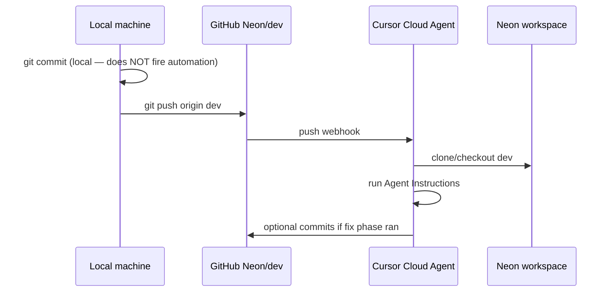

# Neon Cursor Automations

## How triggering works

Your **"Test loop"** automation (screenshot) is configured correctly at the trigger level:

| UI field | Meaning |
|----------|---------|
| **Neon** | GitHub repo `YanShlain/Neon` connected to Cursor |
| **dev** | Branch filter — only pushes to `dev` count |
| **Push … by Me** | Fires when **you** push commits to `dev` on GitHub |



**Important:**

- **Local `git commit` alone does not trigger** the cloud automation.
- You must **`git push origin dev`** (or push via PR merge to `dev`).
- **"by Me"** = your linked GitHub account; other contributors' pushes won't trigger this rule unless you add them.
- The agent runs in **Cursor Cloud** with access to the repo at the pushed commit SHA.

For **local commit** hooks, see [review-on-local-commit.hook.example.sh](review-on-local-commit.hook.example.sh) (requires Cursor CLI).

---

## What's missing in your current setup

From your screenshot:

| Part | Your config | Should be |
|------|-------------|-----------|
| **Trigger** | Push in Neon on dev by Me | OK — matches intent |
| **Agent instructions** | `/multi-model-review` only | **Replace** — that skill is not in Neon. Use **`/review-loop`** + steps from [agent-instructions.md](agent-instructions.md) |
| **Model** | GPT-5.5 Medium | OK — any capable model works |
| **Tools** | Memories only | OK for code review. For UI E2E see [Browser / UI E2E](#browser--ui-e2e-in-automations) below |

### Fix in 2 minutes

1. Open **Test loop** → **Agent instructions**
2. **Replace** the one-liner `Use /review-loop + steps from agent-instructions.md` with the **full prompt** from [agent-instructions.md](agent-instructions.md) (cloud agents may not follow file references)
3. Save (automation stays **Active**)

---

## Prefill files

| File | Branch | Use |
|------|--------|-----|
| [review-on-dev.prefill.json](review-on-dev.prefill.json) | `dev` | Matches your screenshot |
| [review-on-push.prefill.json](review-on-push.prefill.json) | `main` | Production branch variant |

Ask in chat: *Open Automations with Neon dev review prefill* to load `review-on-dev.prefill.json`.

---

## Test the trigger

```powershell
cd c:\Users\YanSh\Dev\Neon
git checkout dev
# make a small change, commit
git push origin dev
```

Then check **Automations → Test loop → Runs** for a new cloud agent run.

---

## Browser / UI E2E in automations

The IDE’s built-in **Browser MCP** is for **local** Agent runs in Cursor Desktop. **Test loop** runs as a **Cloud Agent** — different setup.

### Option 1 — No extra MCP (recommended for Neon)

Cloud agents have **computer use**: a VM with a desktop and browser. No MCP needed.

1. Keep **Tools** as Memories only (or empty).
2. Add to **Agent instructions** (UI expert step):

```
UI expert: In the cloud VM, run `go run ./cmd/api` in background, open http://localhost:8080,
walk S-1 (flight → seats → payment → confirm). Screenshot failures. Use HOLD_DURATION=2m if needed.
```

### Option 2 — Add MCP to the automation

**A. Register MCP once** (Cursor Settings → **Tools & MCP**, or [cursor.com/agents](https://cursor.com/agents) → MCP):

Project file `.cursor/mcp.json` example (Playwright):

```json
{
  "mcpServers": {
    "playwright": {
      "command": "npx",
      "args": ["-y", "@executeautomation/playwright-mcp-server"]
    }
  }
}
```

Restart Cursor; confirm green dot under **Settings → Tools & MCP**.

**B. Attach to Test loop:**

1. **Automations → Test loop → Settings**
2. **Tools → + Add Tool or MCP**
3. Select **MCP server** → pick `playwright` (or your server name)
4. Save

**C. Reference in Agent instructions:**

```
UI expert: Use Playwright MCP. Start `go run ./cmd/api`, navigate to http://localhost:8080, verify E-E1 happy path.
```

### Local `/review-loop` in chat

Built-in browser tools work automatically — no automation MCP step needed.

| Where | UI testing |
|-------|------------|
| Test loop (cloud, on push) | VM browser (Option 1) or MCP on automation (Option 2) |
| Local chat `/review-loop` | IDE browser / computer use |
