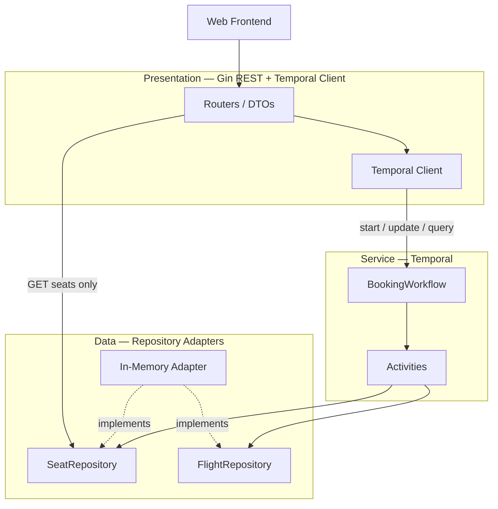

# Neon

A multi-flight seat reservation and payment system orchestrated by [Temporal](https://temporal.io/). Users browse flights, hold seats on a 15-minute refreshable timer, and complete booking with a simulated 5-digit payment code.

**Requirements:** [docs/final_requierments.md](docs/initial_requierments.md) · **Architecture:** [docs/design_overview.md](docs/final_plan.md)

---

## Project overview

Neon lets anonymous users book seats on one or more flights. Each flight has its own seat inventory — seat `1A` on flight `NA4821` is independent from `1A` on flight `NA1954`.

### Booking flow

1. **Select a flight** — creates an order and starts a 15-minute hold timer.
2. **Choose seats** — holds are applied per flight; the timer **resets to a full 15 minutes** on every seat change.
3. **Pay** — submit a 5-digit code; validation runs with a 10-second timeout and a 15% simulated failure rate.
4. **Confirm or fail** — successful payment moves seats from `HELD` to `BOOKED`; timer expiry or exhausted payment attempts release all held seats.

### Payment rules

| Rule | Detail |
|------|--------|
| Code format | Exactly 5 digits |
| Attempts per order | Up to **3 consecutive failed** payment attempts (any codes); order becomes `PAYMENT_FAILED` |
| Timer during payment | The 15-minute timer **never pauses**, even while payment is validating |

### Order states

| State | Meaning |
|-------|---------|
| `CREATED` | Order started; timer running; no seats held yet |
| `SEATS_HELD` | Seats held; timer running (refreshes on seat changes) |
| `AWAITING_PAYMENT` | Payment validation in progress; timer still running |
| `CONFIRMED` | Terminal success — seats booked |
| `EXPIRED` | Terminal failure — timer reached zero |
| `CANCELLED` | Terminal failure — user cancelled |
| `PAYMENT_FAILED` | Terminal failure — 3 consecutive payment failures |

---

## Design overview

Neon follows a **three-tier model** where Temporal owns orchestration in the service layer. The web frontend talks to a Go REST API; the API starts, updates, and queries Temporal workflows; activities perform side effects through repository interfaces.



### Layer responsibilities

| Layer | Technology | Owns |
|-------|------------|------|
| **Presentation** | Go (Gin), Temporal Client | HTTP routes, DTOs, workflow start/update/query, static web UI |
| **Service** | Temporal Workflow + Activities | Order state machine, timer, payment retry limits, atomic hold swap |
| **Data** | Repository interfaces | Seat and flight inventory (in-memory for MVP) |

### Key design decisions

- **Single workflow per order** — one `BookingWorkflow` owns the full lifecycle (timer, holds, payment, expiry). Workflow ID equals `order_id`.
- **Read/write split for seats** — `GET /api/v1/flights/{flight_id}/seats` reads the seat repository directly; all seat mutations go through Temporal activities.
- **Atomic seat updates** — `SwapSeats` activity uses repository `SwapHold`; rollback-safe on conflict.
- **Workflow updates for payment** — `UpdateSubmitPayment` runs synchronously (no signal polling).
- **Hold reconciliation** — on startup, running workflows re-apply seat holds into memory after process restart.
- **Two binaries** — `cmd/api` (HTTP + embedded worker by default) and `cmd/worker` (standalone). **In-memory inventory requires a single shared process** unless you add durable storage.
- **MVP storage** — in-memory repositories seeded at startup. Postgres adapter planned via `SeatRepository` interface.

### API surface

| Method | Path | Purpose |
|--------|------|---------|
| GET | `/api/v1/flights` | List flights |
| GET | `/api/v1/flights/{flight_id}/seats` | Seat map (`?order_id=` highlights caller's holds) |
| POST | `/api/v1/orders` | Start booking (`{ "flight_id" }`) |
| PATCH | `/api/v1/orders/{order_id}/seats` | Update held seats |
| POST | `/api/v1/orders/{order_id}/payment` | Submit 5-digit payment code |
| POST | `/api/v1/orders/{order_id}/cancel` | Cancel order |
| GET | `/api/v1/orders/{order_id}` | Order status, timer, payment events |
| GET | `/api/v1/orders/{order_id}/stream` | SSE order status (1s interval; UI falls back to 2s polling) |

The static web UI is served from the API at `/` (flight list → seat map → payment → confirmation).

For sequence diagrams, workflow update internals, and phased MVP delivery, see [docs/final_plan.md](docs/final_plan.md).

---

## Running locally

### Prerequisites

- **Go 1.24+**
- No external Temporal server required — the API embeds a dev server by default.

### Quick start

```powershell
cd c:\Users\YanSh\Dev\Neon

go test ./...
go run ./cmd/api
```

Open **http://localhost:8080** in your browser.

The API seeds flight inventory, starts an embedded Temporal dev server (`TEMPORAL_AUTO_DEV=1`), registers the booking worker on task queue `booking-task-queue`, and serves the web UI.

### Environment variables

| Variable | Default | Purpose |
|----------|---------|---------|
| `TEMPORAL_AUTO_DEV` | `1` | Embed Temporal dev server when no external server is reachable |
| `TEMPORAL_HOST` | `127.0.0.1:7233` | External Temporal address (used when auto-dev is off) |
| `HOLD_DURATION` | `15m` | Hold timer length (`30s` or `2m` useful for manual testing) |
| `API_ADDR` | `:8080` | HTTP listen address |
| `EMBED_TEMPORAL_WORKER` | `1` | When `0`, API does not run the worker (requires separate `cmd/worker` **and** `ALLOW_SPLIT_INMEMORY=1` with shared storage) |
| `ALLOW_SPLIT_INMEMORY` | — | Set to `1` to override split-deploy guard (not safe with in-memory seats) |

Optional test hooks for payment simulation:

| Variable | Purpose |
|----------|---------|
| `PAYMENT_NEVER_FAIL` | Always succeed payment validation |
| `PAYMENT_ALWAYS_FAIL` | Always fail payment validation |
| `PAYMENT_FAIL_UNTIL` | Fail the first N RNG calls, then succeed |
| `PAYMENT_VALIDATION_DELAY` | Artificial delay in payment activity (e.g. `2s`, `5s`) |

Example — shorter timer for manual testing:

```powershell
$env:HOLD_DURATION = "2m"
go run ./cmd/api
```

### Troubleshooting

**Port already in use (second `go run ./cmd/api`)**

The API binds `API_ADDR` **before** starting Temporal or the worker. A second instance on the same port exits immediately with a clear error instead of leaving orphaned Temporal processes.

To stop the existing server:

```powershell
netstat -ano | findstr ":8080"
Stop-Process -Id <PID> -Force
```

Or use a different port (E2E tests use `:8081`, `:41882`–`:41886`, etc.):

```powershell
$env:API_ADDR = ":8081"
go run ./cmd/api
```

**Inventory resets on restart** — seat holds and bookings live in memory per API process. Restarting the server clears all held and booked seats.

### Running the worker separately

For a split deployment, run an external Temporal server and start the worker independently:

```powershell
$env:TEMPORAL_AUTO_DEV = "0"
$env:TEMPORAL_HOST = "127.0.0.1:7233"
go run ./cmd/worker
```

In typical local development, `go run ./cmd/api` is sufficient.

---

## Testing

### Go unit and integration tests

```powershell
go test ./... -count=1 -timeout 120s
```

### End-to-end tests (Playwright)

Browser tests live in [`tests/e2e/`](tests/e2e/). Each test starts its own `go run ./cmd/api` with embedded Temporal and drives the static UI. Traceability to [docs/initial_requirements.md](docs/initial_requirements.md) is in [docs/qa_review.md](docs/qa_review.md).

**Prerequisites:** Node.js (for npm), Go 1.24+ on `PATH`.

**First-time setup:**

```powershell
cd c:\Users\YanSh\Dev\Neon
npm install
npx playwright install chromium
```

**Run the full E2E suite:**

```powershell
npm run test:e2e
```

**Run a single spec or test:**

```powershell
npx playwright test tests/e2e/booking-flow.spec.ts
npx playwright test -g "IR-3"
```

The harness uses fixed ports (`8080`, `8081`, `41882`–`41886`) and kills any stale listener on those ports before each server start. Tests also clear inherited `PAYMENT_*` shell variables so failure scenarios are deterministic.

**Stop leftover test or dev servers**

If a run is interrupted or ports stay busy, stop listeners on the E2E ports:

```powershell
$ports = 8080, 8081, 41882, 41883, 41884, 41886
foreach ($port in $ports) {
  $lines = netstat -ano | findstr ":$port" | findstr LISTENING
  foreach ($line in $lines) {
    $pid = ($line -split '\s+')[-1]
    if ($pid -and $pid -ne '0') {
      Stop-Process -Id $pid -Force -ErrorAction SilentlyContinue
    }
  }
}
```

To stop only the default dev server on port 8080:

```powershell
netstat -ano | findstr ":8080"
Stop-Process -Id <PID> -Force
```

Embedded Temporal dev processes exit when their parent `go run ./cmd/api` is stopped. If Temporal CLI children remain, stop the parent API process first.

---

## Project layout

```
cmd/
  api/          HTTP server + embedded UI
  worker/       Temporal worker (optional split)
domain/         Core types and repository interfaces
internal/
  api/          Gin routes, handlers, DTOs
  app/          Bootstrap, hold reconciliation
  infrastructure/
    memory/     In-memory flight/seat repositories
    temporal/   Temporal client, dev server, order service
  workflow/
    booking/    BookingWorkflow, activities, payment logic
  web/          Static HTML/JS/CSS (embedded)
docs/
  final_requierments.md   Locked functional requirements
  final_plan.md           Architecture and MVP phases
```

---

## Documentation

| Document | Description |
|----------|-------------|
| [docs/final_requierments.md](docs/final_requierments.md) | Functional requirements, state machine, scenarios |
| [docs/final_plan.md](docs/final_plan.md) | Three-tier architecture, API contract, MVP phases, test matrix |
| [docs/manual_tests.md](docs/manual_tests.md) | Step-by-step manual test scripts |
| [docs/qa_review.md](docs/qa_review.md) | E2E traceability vs initial requirements, mismatches |
| [docs/design_overview.md](docs/design_overview.md) | Detailed design reference and component map |
