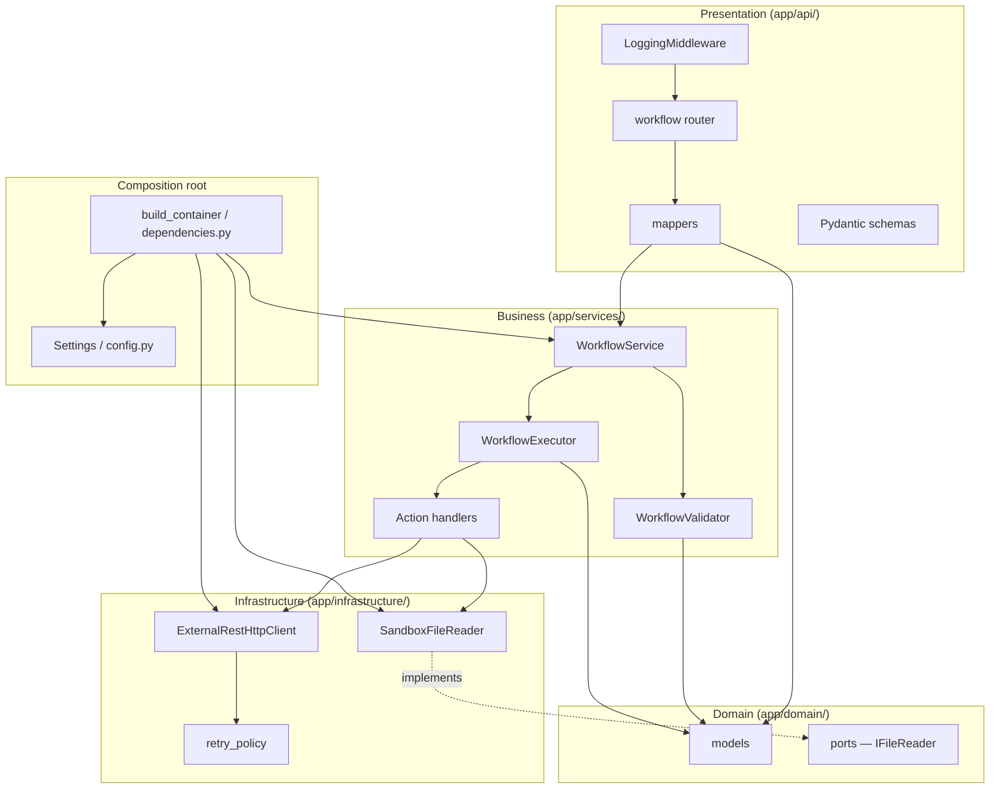
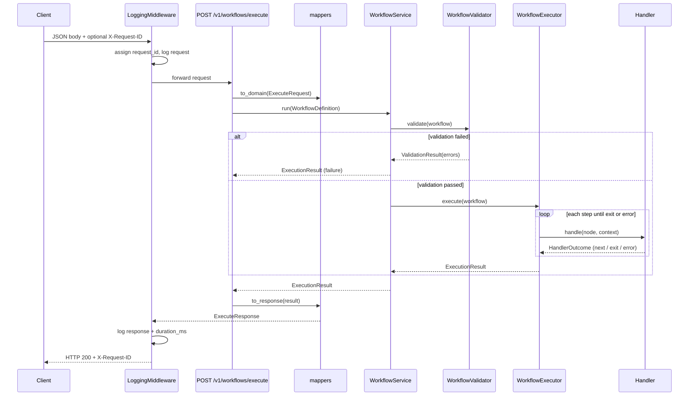
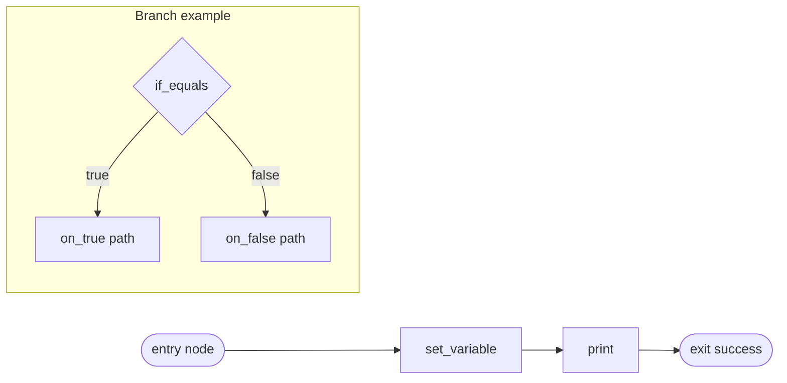
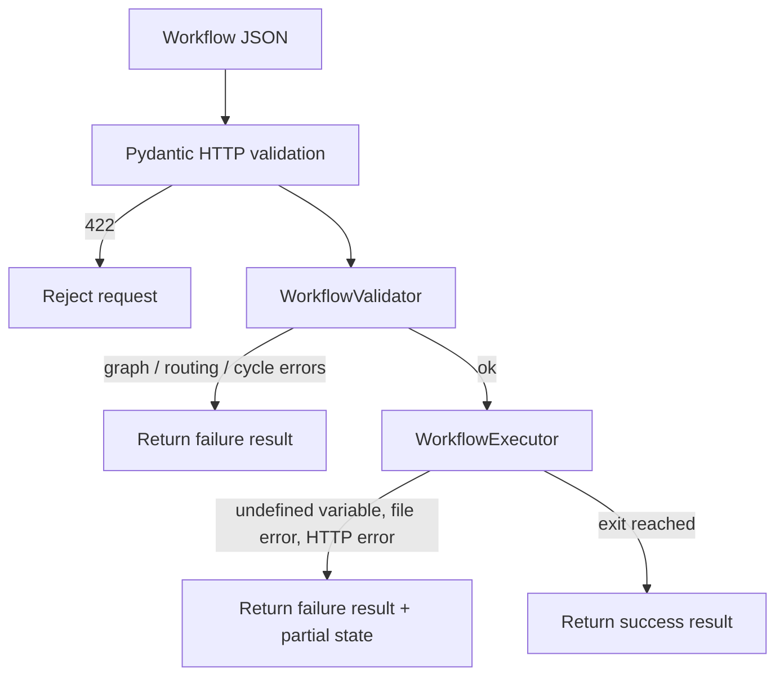
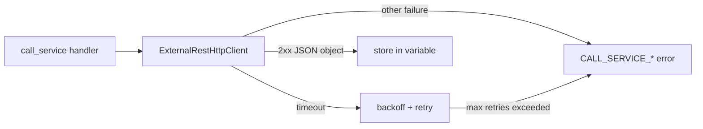
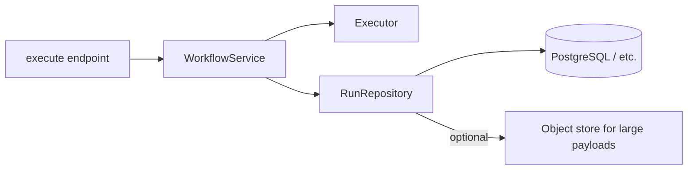
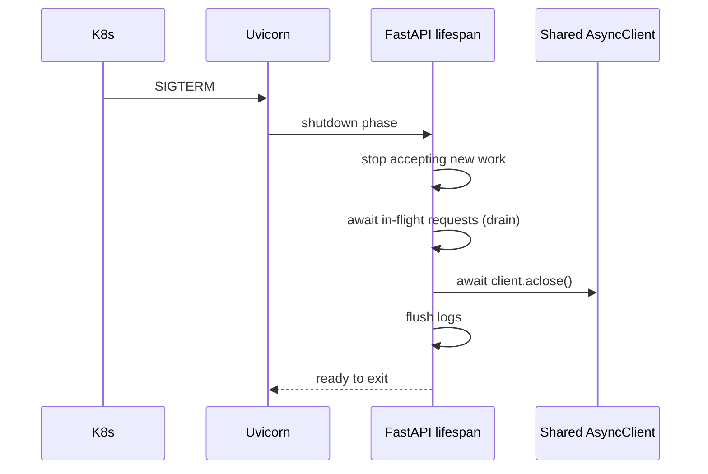
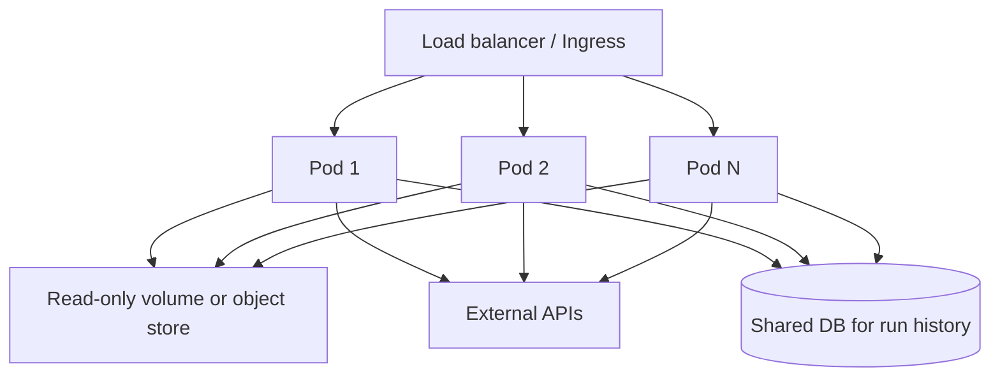
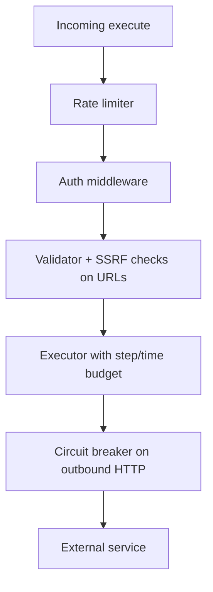
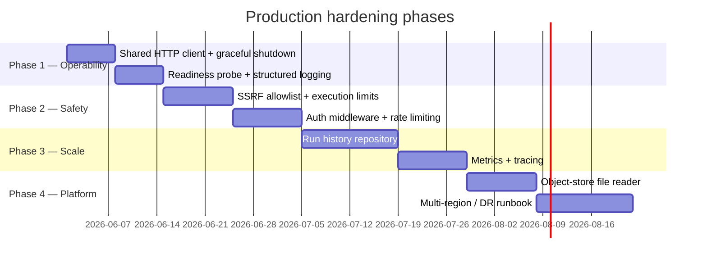

# Workflow Evaluator — Design

This document explains how the **Surfai Workflow Evaluator** works today, how the layers fit together, and what remains to make the service **production-ready, scalable, and resilient**.

For API usage and quick start, see [README.md](../README.md).

---

## 1. Purpose

The service receives a **workflow graph** as JSON, validates its structure, executes each step in order (with branching), and returns:

| Field | Description |
|-------|-------------|
| `status` | `success` or `failure` |
| `variables` | In-memory key/value state accumulated during execution |
| `prints` | Lines produced by `print` nodes |
| `error` | Structured error when validation or runtime fails (`null` on success) |

Callers send a single request and receive a complete result. There is no polling, streaming, or run history in the current MVP.

---

## 2. Architecture

The codebase follows a **3-tier layout** with strict dependency direction: API → Service → Domain ← Infrastructure.

### Layer responsibilities

| Layer | Path | May call | Must not |
|-------|------|----------|----------|
| **Presentation** | `app/api/` | Service use cases | DB drivers, raw HTTP, repository internals |
| **Business** | `app/services/` | Domain + port interfaces | FastAPI, httpx, filesystem |
| **Domain** | `app/domain/` | Pure types and rules | Any I/O |
| **Infrastructure** | `app/infrastructure/` | External SDKs (httpx, filesystem) | HTTP response shaping |

**Composition root:** `build_container()` in `app/dependencies.py` wires `Settings` → file reader → HTTP client → validator → executor → `WorkflowService` at startup (`app/main.py` lifespan).

---

## 3. End-to-end request flow

### HTTP status policy

| Situation | HTTP status |
|-----------|---------------|
| Malformed JSON / schema (Pydantic) | **422** |
| Valid request, business success or failure | **200** |
| Uncaught exception | **200** with `error.code: INTERNAL_ERROR` |

Business outcomes are always expressed in the response body, not via HTTP error codes.

---

## 4. Workflow execution model

A workflow is a directed graph of **nodes**. Execution starts at `entry` and follows `next` (linear nodes) or `on_true` / `on_false` (branch nodes) until an `exit` node or a runtime error.

### Supported actions

| Action | Routing | Effect |
|--------|---------|--------|
| `set_variable` | linear (`next`) | Set a variable (string or number) |
| `call_service` | linear | POST to external URL; store JSON response as string |
| `read_file` | linear | Read sandboxed file into a variable |
| `print` | linear | Concatenate parts → one line → append to `prints` |
| `if_equals` | branch | Compare operands (coerced to string) |
| `if_file_exists` | branch | Check file under sandbox root |
| `exit` | terminal | End workflow with `success` or `failure` status |

### Validation vs runtime

**Validator** (`WorkflowValidator`) checks schema version, unique IDs, routing exclusivity, cycles, reachable `exit`, and `call_service` caps.

**Executor** (`WorkflowExecutor`) runs handlers. On failure it returns variables and prints accumulated **before** the failing step.

---

## 5. External I/O

### File access — `SandboxFileReader`

- All paths are **relative** to `WORKFLOW_FS_ROOT` (env, default `.`).
- Rejects absolute paths and `..` traversal.
- Used by `read_file` and `if_file_exists`.

### HTTP — `ExternalRestHttpClient`

- Async POST via httpx.
- **Retries only on timeout** with exponential backoff + jitter.
- Connection errors, non-2xx, and invalid JSON fail immediately (no retry).
- Each `call_service` step may create a new client unless a shared instance is injected.

---

## 6. Observability (current)

| Concern | Implementation |
|---------|----------------|
| Request logging | `LoggingMiddleware` — full JSON body, `duration_ms`, `X-Request-ID` |
| Correlation | Generate UUID if `X-Request-ID` missing; echo on response |
| Errors | `logger.exception` for unhandled errors; WARNING on step failures |
| Health | `GET /health` → `{"status": "ok"}` (liveness only) |

Logging uses plain text (`logging.basicConfig`). There are no metrics, traces, or structured JSON log format yet.

---

## 7. Configuration

Settings are loaded from environment variables in `app/config.py` at startup.

| Variable | Default | Purpose |
|----------|---------|---------|
| `WORKFLOW_FS_ROOT` | `.` | Sandbox root for file operations |
| `CALL_SERVICE_TIMEOUT_SECONDS` | `10` | Default per-attempt HTTP timeout |
| `CALL_SERVICE_MAX_TIMEOUT_SECONDS` | `60` | Max allowed node timeout |
| `CALL_SERVICE_MAX_RETRIES` | `3` | Default extra retries after first attempt |
| `CALL_SERVICE_RETRY_BASE_SECONDS` | `0.5` | Backoff base |
| `CALL_SERVICE_RETRY_MAX_SECONDS` | `30` | Backoff cap |
| `CALL_SERVICE_MAX_RETRIES_CAP` | `5` | Max allowed node retries |

---

## 8. Current state (MVP)

What is implemented and tested:

- Single execute endpoint + basic health check
- Full graph validation and all seven action handlers
- Sandbox file reads and async outbound HTTP with timeout retry
- Fail-without-crash exception handling
- Request/response logging with correlation ID
- ~90%+ test coverage on `app/`

What is **not** implemented (by design for MVP):

- Authentication and authorization
- Rate limiting
- Run history or persistence
- SSRF / host allowlists for `call_service`
- Graceful shutdown of shared resources
- Readiness probes, metrics, distributed tracing
- Global step/time limits on workflow execution

---

## 9. Path to production

The sections below describe recommended work to harden the service for production traffic, horizontal scaling, and operational resilience.

### 9.1 Persistent storage

**Today:** Every execution is stateless. Variables, prints, and outcomes exist only in the HTTP response.

**Production need:** Store run metadata and optionally outputs for audit, replay, debugging, and async workflows.

**Recommended approach:**

1. Define a `RunRepository` port in `app/domain/ports.py`:
   - `create_run(workflow_hash, request_id) → run_id`
   - `complete_run(run_id, result, duration_ms)`
   - `get_run(run_id)` for future GET-by-id API
2. Implement `PostgresRunRepository` in infrastructure with migrations (run id, request id, status, error JSON, timestamps, workflow snapshot hash).
3. Keep execution in-memory; persist **after** completion to avoid slowing the hot path (or use async write-behind queue).
4. Add retention policy and PII redaction before storing request bodies.

### 9.2 Graceful shutdown

**Today:** Lifespan starts the container but does not close httpx clients or drain in-flight requests on shutdown.

**Recommended approach:**

1. Create a **shared** `httpx.AsyncClient` in `build_container()` with connection limits; inject into `ExternalRestHttpClient`.
2. Extend lifespan shutdown (`yield` after block):
   - Set a shutdown flag or rely on uvicorn drain
   - `await http_client.aclose()`
   - Close any DB pool opened for run history
3. Configure uvicorn `--timeout-graceful-shutdown` (e.g. 30s) aligned with K8s `terminationGracePeriodSeconds`.
4. Use K8s `preStop` hook sleep briefly so load balancer stops sending traffic before drain begins.

### 9.3 Scalability

**Today:** Single process, no shared state between instances. This scales **horizontally** for stateless execute calls as long as file sandbox and outbound HTTP limits are acceptable per pod.

**Recommended approach:**

1. **Stateless pods** — no in-memory session state; all workflow state stays in the request/response (or DB once persistence exists).
2. **File sandbox** — mount a read-only volume or replace local FS with S3-compatible object storage behind `IFileReader`.
3. **Connection pooling** — one shared httpx client per process with `limits=httpx.Limits(max_connections=..., max_keepalive_connections=...)`.
4. **Autoscaling** — HPA on CPU and request latency; set sensible `resources.requests/limits`.
5. **Execution limits** — add max steps, max wall-clock time, and max `prints` length to prevent abuse (see §9.5).

### 9.4 Resilience

| Risk | Mitigation |
|------|------------|
| External service slow/down | Existing timeout + retry on timeout; add circuit breaker per host |
| SSRF via `call_service` | Host allowlist env (`CALL_SERVICE_ALLOWED_HOSTS`), block private IP ranges |
| Runaway workflows | Global step counter and wall-clock deadline in executor |
| Large payloads | Max request body size (middleware), max response body from outbound calls |
| Thundering herd on retry | Jitter already present; cap concurrent outbound calls per host |
| Partial failures | Already returns partial `variables`/`prints`; document contract for clients |

### 9.5 Security and multi-tenancy

Before exposing the service beyond trusted internal callers:

1. **Authentication** — API key, mTLS, or OAuth2 JWT at middleware; propagate identity to logs and run records.
2. **Authorization** — per-tenant sandbox roots and outbound URL policies.
3. **Input hardening** — strict max nodes, max nesting, max string lengths in validator.
4. **Secrets** — never log full request bodies in production; redact tokens in `call_service` payloads.

### 9.6 Observability for operations

| Capability | Tooling suggestion |
|------------|-------------------|
| Structured logs | JSON formatter; fields: `request_id`, `run_id`, `status`, `duration_ms` |
| Metrics | Prometheus: request count, latency histogram, validation vs runtime failures, outbound call outcomes |
| Tracing | OpenTelemetry spans on execute, validator, each handler, outbound HTTP |
| Health | `GET /health` (liveness), `GET /ready` (DB ping, disk/volume accessible) |
| Alerting | Error rate, p99 latency, circuit breaker open, pod restarts |

### 9.7 Suggested implementation phases

---

## 10. Key source files

| Area | Path |
|------|------|
| ASGI entry | `main.py` |
| App factory | `app/main.py` |
| Routes | `app/api/routes/workflow.py` |
| Schemas | `app/api/schemas/execute.py` |
| Middleware | `app/api/middleware/logging.py` |
| Service orchestration | `app/services/workflow_service.py` |
| Validation | `app/services/validator.py` |
| Execution | `app/services/executor.py` |
| Handlers | `app/services/handlers/` |
| Domain models | `app/domain/models.py` |
| DI / config | `app/dependencies.py`, `app/config.py` |
| File + HTTP I/O | `app/infrastructure/file_reader.py`, `app/infrastructure/http_client.py` |

For the full workflow JSON schema and validation matrix, see [plan.md](../plan.md).
