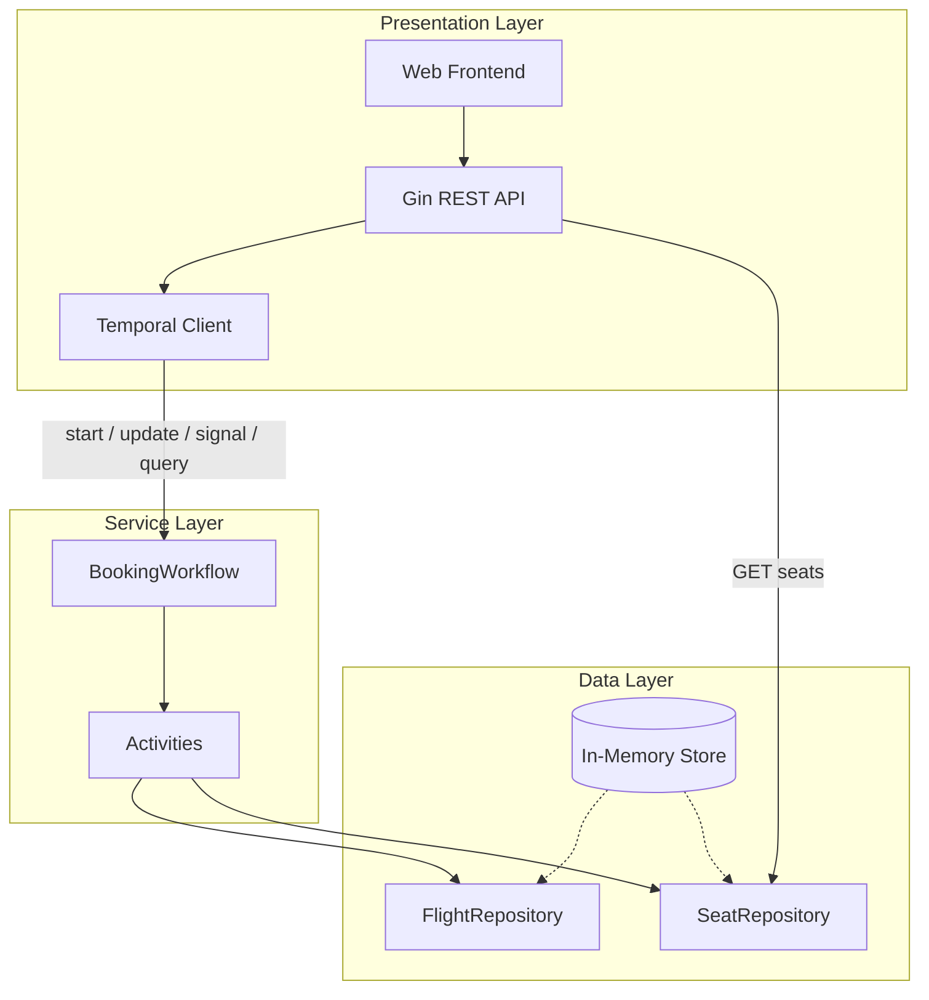
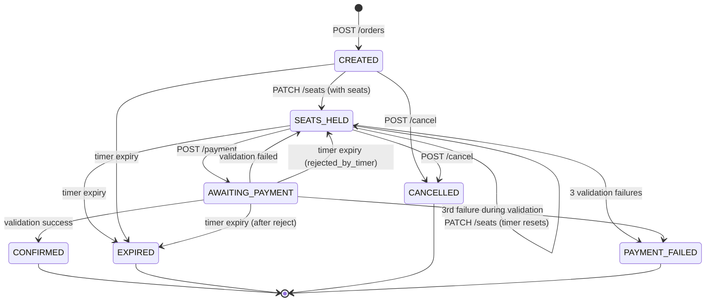
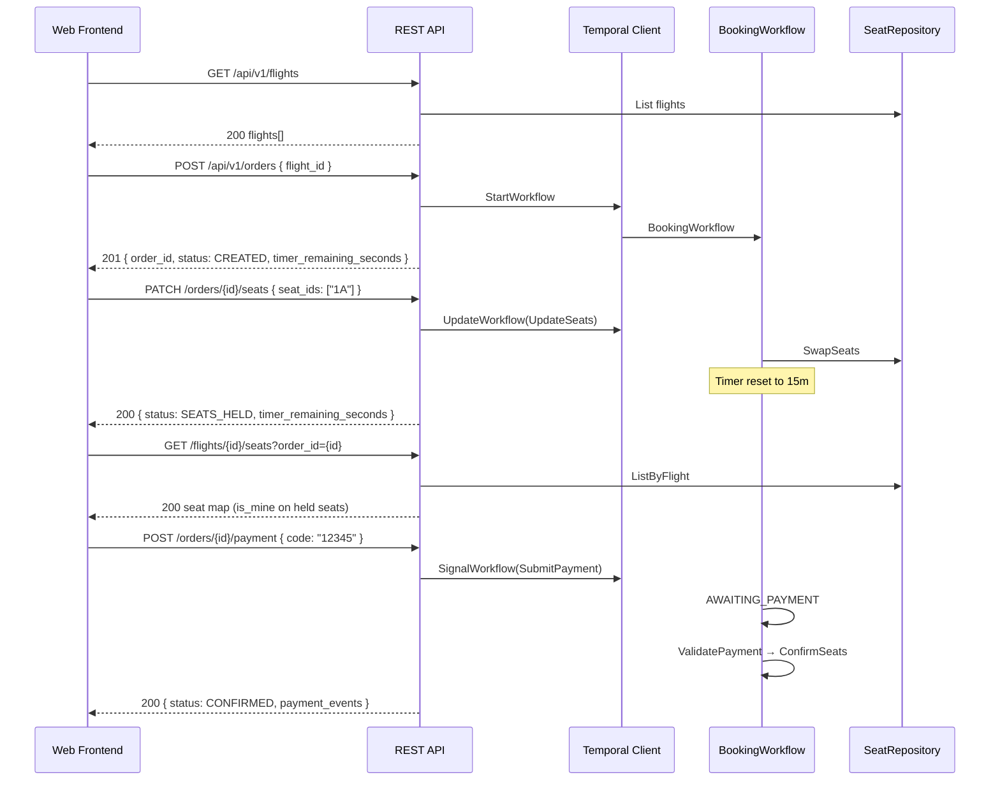
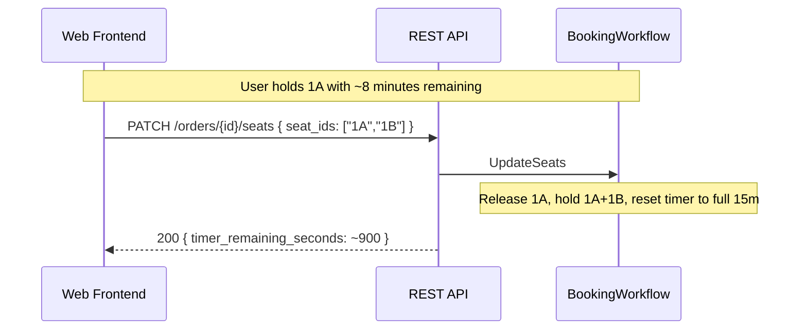
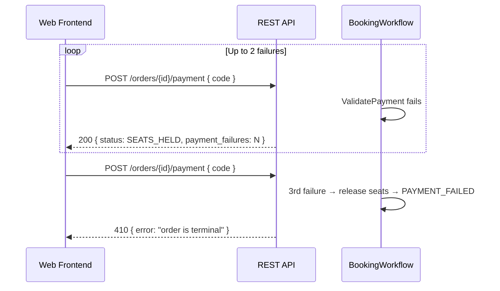
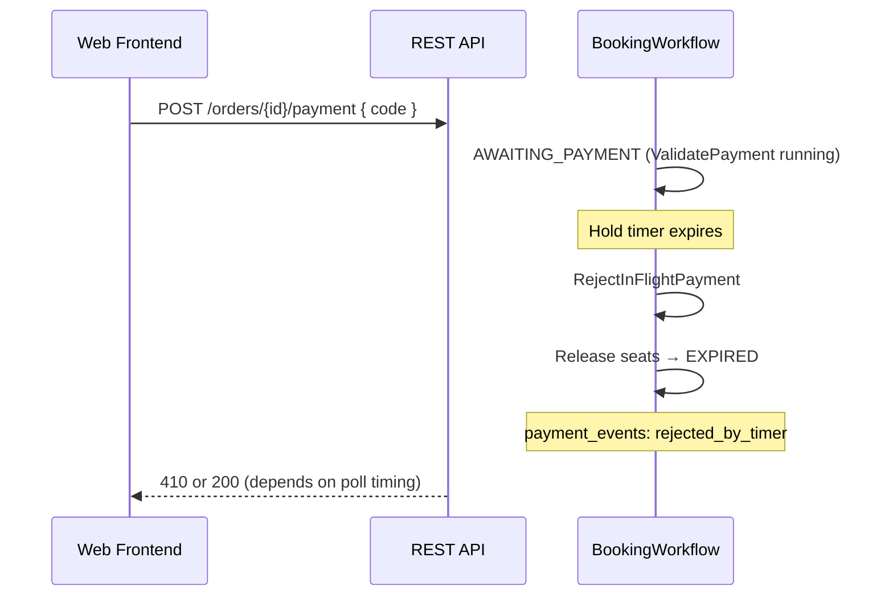
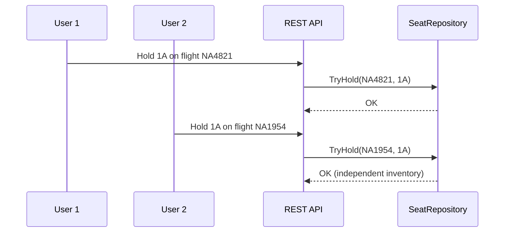

# Design Overview: Neon Flight Booking System

> **Status:** Reflects current implementation  
> **Last updated:** 2026-05-28  
> **Related:** [final_requierments.md](final_requierments.md) · [final_plan.md](final_plan.md) · [README.md](../README.md)

---

## 1. System context

Neon is a multi-flight seat reservation system. Each order is owned by a single Temporal workflow that orchestrates seat holds, a continuous hold timer, and simulated payment validation. A Go REST API exposes booking operations to a static web frontend.

| Concern | Implementation |
|---------|----------------|
| API server | Go + Gin (`cmd/api`) |
| Orchestration | Temporal `BookingWorkflow` (namespace `flight-booking`, task queue `booking-task-queue`) |
| Persistence (MVP) | In-memory `FlightRepository` and `SeatRepository`, seeded at startup |
| Frontend | Embedded static HTML/JS/CSS served by the API |
| Auth | None — anonymous multi-user; concurrent holds allowed |

**Base URL:** `http://localhost:8080` (default)  
**API prefix:** `/api/v1`

---

## 2. Architecture

### 2.1 Three-tier model



| Layer | Responsibility |
|-------|----------------|
| **Presentation** | HTTP routing, request validation, DTO mapping, Temporal client calls, static UI |
| **Service** | Order state machine, hold timer, payment retry logic, selector loop |
| **Data** | Flight catalog and per-flight seat inventory (`TryHold`, `Release`, `Confirm`) |

**Read/write split:** Seat map reads bypass Temporal. All seat mutations go through workflow activities.

### 2.2 Temporal integration

| Operation | Temporal mechanism | Used by |
|-----------|-------------------|---------|
| Create order | `ExecuteWorkflow` | `POST /orders` |
| Update seats | Workflow update `UpdateSeats` | `PATCH /orders/{id}/seats` |
| Cancel order | Workflow update `CancelOrder` | `POST /orders/{id}/cancel` |
| Submit payment | Workflow update `SubmitPayment` | `POST /orders/{id}/payment` |
| New payment method | Workflow update `StartNewPaymentMethod` | `POST /orders/{id}/payment/new-method` |
| Read order | Query `GetStatus` | `GET /orders/{id}`, SSE stream |

Workflow ID equals `order_id` (UUID, 1:1 mapping).

### 2.3 Order state machine



| Status | Terminal | Description |
|--------|----------|-------------|
| `CREATED` | No | Order started; timer running; no seats held |
| `SEATS_HELD` | No | One or more seats held; timer running |
| `AWAITING_PAYMENT` | No | Payment activity in progress; timer still running |
| `CONFIRMED` | Yes | Payment succeeded; seats booked |
| `EXPIRED` | Yes | Hold timer reached zero; seats released |
| `CANCELLED` | Yes | User cancelled; seats released |
| `PAYMENT_FAILED` | Yes | Three payment validation failures; seats released |

### 2.4 Seat states

| Status | Meaning |
|--------|---------|
| `AVAILABLE` | Open for booking |
| `HELD` | Reserved by an active order |
| `BOOKED` | Confirmed after successful payment |

Inventory is isolated per `flight_id`. Seat `1A` on flight `NA4821` is independent from `1A` on flight `NA1954`.

### 2.5 Hold timer rules

- Starts when `POST /orders` creates the workflow (default **15 minutes**, overridable via `HOLD_DURATION`).
- **Resets to full duration** on every successful `PATCH /orders/{id}/seats`.
- **Never pauses** during payment validation (`AWAITING_PAYMENT`).
- On expiry: in-flight payment is rejected (`rejected_by_timer` event), held seats are released, order becomes `EXPIRED`.

### 2.6 Payment rules (implementation)

| Rule | Value |
|------|-------|
| Code format | Exactly 5 digits (`0`–`9`) |
| Validation timeout | 10 seconds (activity `StartToCloseTimeout`) |
| Simulated failure rate | 15% (override via `PAYMENT_*` env vars in dev/test) |
| Attempts per method | **3** failures per 5-digit code |
| Methods per order | **3** different codes (`methods_used` / `methods_remaining` in API) |
| New method | `POST .../payment/new-method` or auto-switch after a code is exhausted |
| Code switch mid-method | Different code with zero failures → HTTP 400; after ≥1 failure on current code → allowed |
| Terminal on exhaustion | After 3 codes × 3 failures each → `PAYMENT_FAILED`, seats released |

---

## 3. Major flows

### 3.1 Happy path (S-1)



### 3.2 Timer refresh (S-2)



### 3.3 Payment failure and exhaustion



### 3.4 Timer vs payment race (S-4)



### 3.5 Multi-flight isolation (S-5)



---

## 4. REST API reference

All JSON request bodies use `Content-Type: application/json`.  
All successful order responses share the **Order response** shape defined in [§4.3](#43-order-response).

### 4.1 Error format

Errors return a JSON object with a single `error` string:

```json
{ "error": "human-readable message" }
```

### 4.2 HTTP status codes

| Code | Meaning | When used |
|------|---------|-----------|
| **200** | OK | Successful GET, PATCH, POST (non-create) |
| **201** | Created | `POST /orders` succeeded |
| **400** | Bad Request | Invalid JSON body, invalid payment code format, payment not allowed in current state |
| **404** | Not Found | Unknown `order_id` or `flight_id` |
| **409** | Conflict | Seat already held by another order (`TryHold` conflict) |
| **410** | Gone | Order is in a terminal state (`EXPIRED`, `CANCELLED`, `PAYMENT_FAILED`) |
| **500** | Internal Server Error | Workflow start failure, unmapped Temporal errors, payment processing timeout |

---

### 4.3 Order response

Returned by all order endpoints on success:

```json
{
  "order_id": "550e8400-e29b-41d4-a716-446655440000",
  "flight_id": "NA4821",
  "status": "SEATS_HELD",
  "held_seat_ids": ["1A", "1B"],
  "timer_remaining_seconds": 847,
  "payment_events": [
    {
      "type": "validation_failed",
      "code": "12345",
      "message": "payment validation failed"
    }
  ],
  "payment_failures": 1
}
```

| Field | Type | Description |
|-------|------|-------------|
| `order_id` | string | UUID; equals Temporal workflow ID |
| `flight_id` | string | Flight this order is booking |
| `status` | string | Order state (see [§2.3](#23-order-state-machine)) |
| `held_seat_ids` | string[] | Currently held seat IDs (e.g. `"1A"`) |
| `timer_remaining_seconds` | int | Seconds until hold expiry; `0` when timer cleared |
| `payment_events` | array | Append-only payment audit log (omitted when empty) |
| `payment_failures` | int | Cumulative failed validation count |

**Payment event types:**

| `type` | Meaning |
|--------|---------|
| `format_invalid` | Code failed format check or payment not allowed |
| `validation_failed` | Simulated gateway rejected the code |
| `validation_success` | Payment validated and seats confirmed |
| `attempts_exhausted` | Third failure — order terminated |
| `rejected_by_timer` | In-flight payment rejected because hold timer expired |

---

### 4.4 Flights

#### `GET /api/v1/flights`

List all seeded flights.

**Request:** No body.

**Response `200`:**

```json
{
  "flights": [
    {
      "id": "NA4821",
      "departure_at": "2026-05-29T14:00:00Z",
      "capacity": 60
    }
  ]
}
```

| Field | Type | Description |
|-------|------|-------------|
| `id` | string | Flight identifier (e.g. `NA4821`) |
| `departure_at` | string (RFC 3339) | Scheduled departure |
| `capacity` | int | Total seats (rows × columns, default 10×6 = 60) |

**Errors:** `500` on repository failure.

---

#### `GET /api/v1/flights/{flight_id}/seats`

Read-only seat map for a flight. Reads `SeatRepository` directly (no Temporal round-trip).

**Query parameters:**

| Param | Required | Description |
|-------|----------|-------------|
| `order_id` | No | When set, seats held by this order have `is_mine: true` |

**Response `200`:**

```json
{
  "flight_id": "NA4821",
  "seats": [
    {
      "seat_id": "1A",
      "status": "HELD",
      "order_id": "550e8400-e29b-41d4-a716-446655440000",
      "is_mine": true
    },
    {
      "seat_id": "1B",
      "status": "AVAILABLE",
      "is_mine": false
    }
  ]
}
```

| Field | Type | Description |
|-------|------|-------------|
| `seat_id` | string | Row + column label (e.g. `"1A"`, `"10F"`) |
| `status` | string | `AVAILABLE`, `HELD`, or `BOOKED` |
| `order_id` | string | Holding order ID (present when `HELD` or `BOOKED`) |
| `is_mine` | bool | `true` when `order_id` query matches this seat's holder |

**Errors:**

| Code | `error` | Cause |
|------|---------|-------|
| `404` | `"flight not found"` | Unknown `flight_id` |
| `500` | `"internal error"` | Repository failure |

---

### 4.5 Orders

#### `POST /api/v1/orders`

Start a new booking workflow for a flight.

**Request body:**

```json
{ "flight_id": "NA4821" }
```

| Field | Required | Description |
|-------|----------|-------------|
| `flight_id` | Yes | Flight to book |

**Response `201`:** [Order response](#43-order-response) with `status: "CREATED"` and `timer_remaining_seconds` ≈ 900 (15m default).

**Errors:**

| Code | `error` | Cause |
|------|---------|-------|
| `400` | `"invalid request body"` | Missing or malformed JSON / `flight_id` |
| `500` | `"internal error"` | Workflow start failed |

---

#### `PATCH /api/v1/orders/{order_id}/seats`

Replace held seats on an order. Releases previous holds, applies new ones, resets the hold timer.

**Path parameters:** `order_id` — UUID from `POST /orders`.

**Request body:**

```json
{ "seat_ids": ["1A", "1B"] }
```

| Field | Required | Description |
|-------|----------|-------------|
| `seat_ids` | Yes | Desired seats; empty array releases all holds |

**Response `200`:** [Order response](#43-order-response) with `status: "SEATS_HELD"` (when seats non-empty) and refreshed `timer_remaining_seconds`.

**Behavior notes:**
- First hold with non-empty `seat_ids` transitions `CREATED` → `SEATS_HELD`.
- Cannot update seats while `AWAITING_PAYMENT` (returns `500` — workflow rejects with `payment_in_progress`).
- Hold limit: up to full plane capacity per order.

**Errors:**

| Code | `error` | Cause |
|------|---------|-------|
| `400` | `"invalid request body"` | Missing or malformed JSON |
| `404` | `"order not found"` | Unknown workflow |
| `409` | `"seat hold conflict"` | Seat already held by another order |
| `410` | `"order is terminal"` | Order in terminal state |
| `500` | `"internal error"` | Unmapped workflow/activity error |

---

#### `POST /api/v1/orders/{order_id}/cancel`

Cancel an active order and release held seats.

**Request:** No body required.

**Response `200`:** [Order response](#43-order-response) with `status: "CANCELLED"`.

**Behavior notes:** Idempotent on already-terminal orders — returns current terminal status without error.

**Errors:**

| Code | `error` | Cause |
|------|---------|-------|
| `404` | `"order not found"` | Unknown workflow |
| `500` | `"internal error"` | Release activity failed |

---

#### `POST /api/v1/orders/{order_id}/payment`

Submit a 5-digit payment code for validation.

**Request body:**

```json
{ "code": "12345" }
```

| Field | Required | Description |
|-------|----------|-------------|
| `code` | Yes | Exactly 5 numeric digits |

**Response `200`:** [Order response](#43-order-response).

Typical outcomes:

| Outcome | HTTP | `status` in body |
|---------|------|------------------|
| Validation failed (attempts remain) | `200` | `SEATS_HELD` |
| Validation succeeded | `200` | `CONFIRMED` |
| Third failure (exhausted) | `410` | — (error body only; order is `PAYMENT_FAILED`) |

**Behavior notes:**
- Order must be in `SEATS_HELD` with at least one held seat.
- Handler validates format before signaling workflow.
- API polls workflow status for up to **12 seconds** waiting for payment activity to settle.
- Timer continues decrementing during validation.

**Errors:**

| Code | `error` | Cause |
|------|---------|-------|
| `400` | `"invalid request body"` | Missing `code` in JSON |
| `400` | `"invalid payment code"` | Not exactly 5 digits |
| `400` | `"payment not allowed"` | Order is `CREATED` (no seats), `CONFIRMED`, or wrong state |
| `404` | `"order not found"` | Unknown workflow |
| `410` | `"order is terminal"` | Order is `EXPIRED`, `CANCELLED`, or `PAYMENT_FAILED` |
| `500` | `"internal error"` | Payment processing timeout or unmapped error |

---

#### `GET /api/v1/orders/{order_id}`

Query current order state from the workflow.

**Response `200`:** [Order response](#43-order-response).

**Errors:**

| Code | `error` | Cause |
|------|---------|-------|
| `404` | `"order not found"` | Unknown workflow |
| `500` | `"internal error"` | Query decode failure |

---

#### `GET /api/v1/orders/{order_id}/stream`

Server-Sent Events (SSE) stream of order status updates.

**Response headers:**
- `Content-Type: text/event-stream`
- `Cache-Control: no-cache`
- `Connection: keep-alive`

**Event format:**

```
event: status
data: {"order_id":"...","status":"SEATS_HELD",...}

```

- Sends current status immediately, then every **1 second**.
- Connection closes silently on client disconnect or repeated query errors.

**Errors (before stream starts):**

| Code | `error` | Cause |
|------|---------|-------|
| `404` | `"order not found"` | Unknown workflow |
| `500` | `"stream not supported"` | Response writer lacks flush support |
| `500` | `"internal error"` | Initial query failure |

---

### 4.6 Static UI routes

Served by the same Gin process (not under `/api/v1`):

| Method | Path | Purpose |
|--------|------|---------|
| GET | `/` | Flight list page |
| GET | `/seats` | Seat selection page |
| GET | `/payment` | Payment page |
| GET | `/css/*` | Stylesheets |
| GET | `/js/*` | Client scripts |

---

## 5. Seed data

At startup the API seeds **10 flights** with IDs such as `NA4821`, `NA1954`, etc. Each flight has a **10×6** seat grid (rows 1–10, columns A–F), producing seat IDs like `1A`, `10F`. All seats start `AVAILABLE`.

Departure times are staggered hourly from approximately 24 hours after server start.

---

## 6. Environment variables

| Variable | Default | Affects |
|----------|---------|---------|
| `API_ADDR` | `:8080` | HTTP listen address |
| `TEMPORAL_AUTO_DEV` | `1` | Embed Temporal dev server when external server unavailable |
| `TEMPORAL_HOST` | `127.0.0.1:7233` | External Temporal address |
| `HOLD_DURATION` | `15m` | Hold timer length (e.g. `30s`, `2m` for testing) |
| `PAYMENT_NEVER_FAIL` | — | Set to `1` to always succeed validation |
| `PAYMENT_ALWAYS_FAIL` | — | Set to `1` to always fail validation |
| `PAYMENT_FAIL_UNTIL` | — | Fail first N validations, then succeed |
| `PAYMENT_VALIDATION_DELAY` | — | Artificial delay in payment activity (e.g. `2s`, `5s`) |

---

## 7. Frontend contract

| Concern | Approach |
|---------|----------|
| Timer display | API returns `timer_remaining_seconds`; client decrements locally between requests |
| Seat map refresh | Refetch `GET .../seats?order_id=` after mutating calls |
| Single active order | `localStorage` tracks `order_id`; UI blocks new booking until terminal state |
| Own holds | Pass `?order_id=` to highlight caller's seats vs grayscale others |
| Real-time updates | Optional SSE via `GET /orders/{id}/stream` (1s interval) |

---

## 8. Component map

```
cmd/api/main.go              HTTP server entrypoint
cmd/worker/main.go           Standalone worker (optional split deployment)
internal/api/router.go       Route registration
internal/api/handler/        HTTP handlers
internal/api/dto/            Request/response types
internal/app/application.go  Bootstrap: repos + Temporal + worker
internal/domain/             Seat, Flight, OrderStatus types
internal/infrastructure/
  memory/                    In-memory repositories + seed
  temporal/                  Client, dev server, OrderService
internal/workflow/booking/   Workflow, activities, payment simulation
internal/web/                Embedded static UI
```

---

*Requirements: [final_requierments.md](final_requierments.md) · Architecture plan: [final_plan.md](final_plan.md)*
