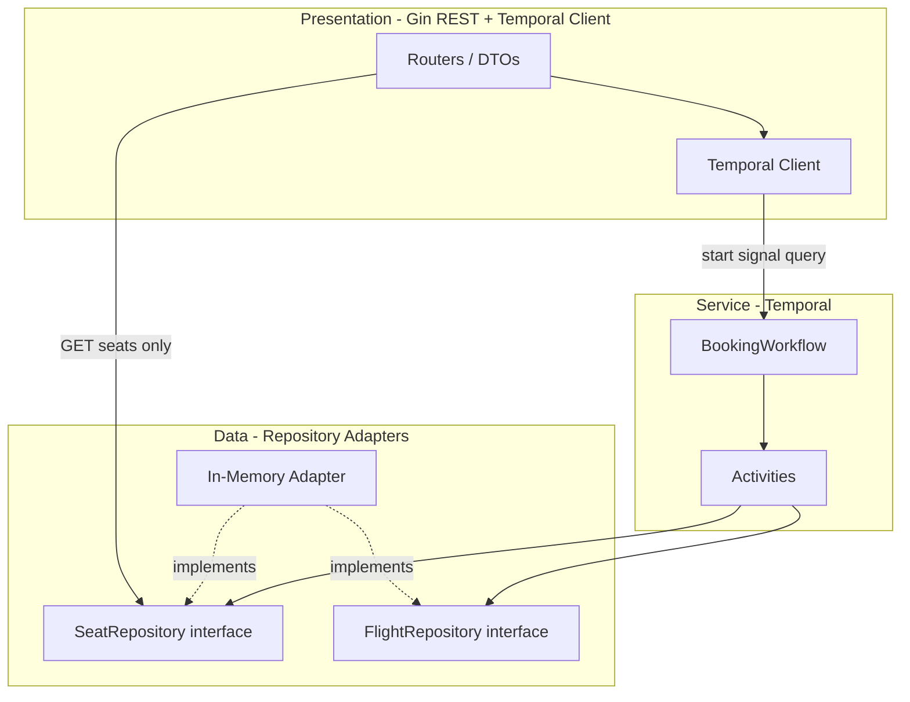
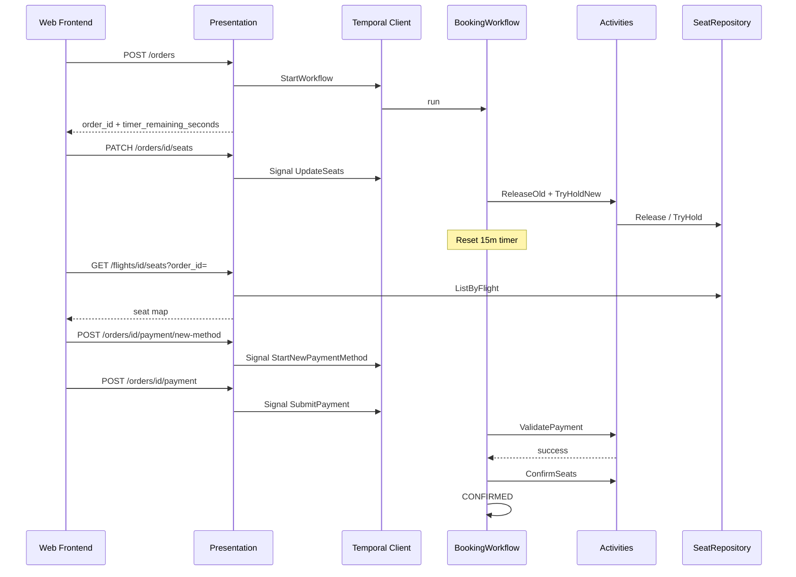
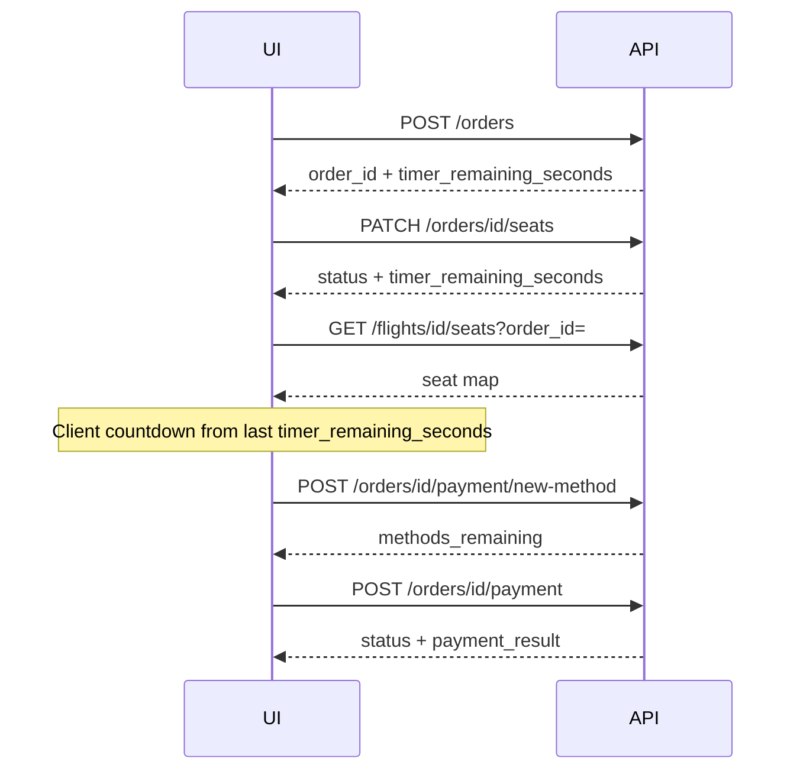
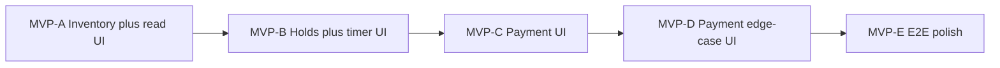
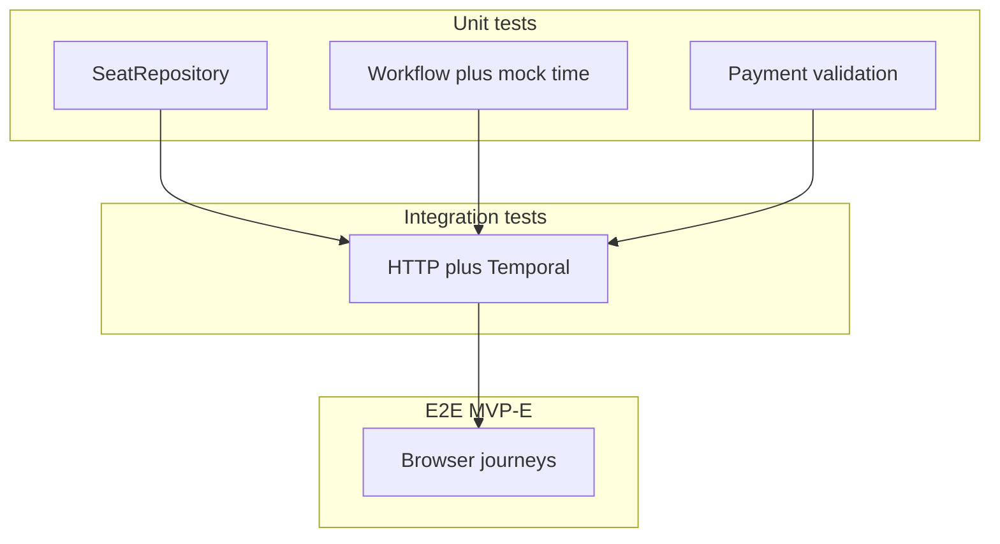
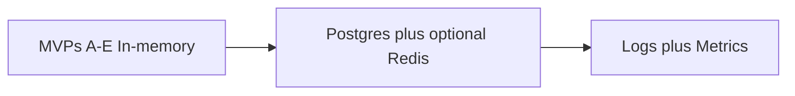

# System Architecture Plan: Flight Booking System (Temporal)

> **Canonical architecture document** for the Neon flight booking system.  
> **Status:** LOCKED  
> **Last updated:** 2026-05-24  
> **Principles:** S.O.L.I.D, 3-Tier Layering, Temporal Orchestration, Layer Agnosticism (repository interfaces).  
> **Requirements:** [final_requierments.md](final_requierments.md) · **Initial stub:** [initial_plan.md](initial_plan.md)

---

## 0. Review of `initial_plan.md`

### 0.1 Verdict

| Aspect | Assessment |
|--------|------------|
| **Clarity** | Insufficient as standalone design — 42-line stub deferring to missing `plan.md`. |
| **Correctness (intent)** | Aligned with locked requirements on timer behavior, signals, seat-map read path, binary split, UI hints. |
| **Completeness** | Major gaps — filled by this document. |

### 0.2 What `initial_plan.md` got right (preserve in implementation)

| # | Decision | Requirement alignment |
|---|----------|----------------------|
| 1 | `GET /api/v1/flights/{flight_id}/seats` reads `SeatRepository`, not Temporal | Read-heavy seat map avoids workflow round-trip; writes go through activities. |
| 2 | Signals `UpdateSeats`, `SubmitPayment`, `CancelOrder`; query `GetStatus` | Single-workflow order lifecycle. |
| 3 | Cancellable 15m timer via selector loop; timer **never pauses** during payment | §2.1 and S-4. |
| 4 | `cmd/api` + `cmd/worker` binaries | Clean Presentation vs worker boundary. |
| 5 | UI: grayscale for others' HELD/BOOKED; highlight own holds via `?order_id=` | Multi-user seat map UX. |

---

## 1. Context

| Item | Value |
|------|--------|
| **Problem** | Multi-flight seat reservation with 15-minute refreshable holds, simulated payment validation, and durable order lifecycle orchestration. |
| **Users / callers** | Anonymous end users via Web Frontend; Temporal workers (same codebase). |
| **Constraints** | Go (API + workers), Temporal (single workflow per order), strong seat-hold consistency, 15m continuous timer, payment 10s timeout / 15% failure / 3 attempts × 3 methods. |
| **Non-goals** | Real payment gateway, auth/identity provider, multi-region, dynamic pricing, email/SMS notifications, Postgres/Redis/metrics until post-MVP-E. |

---

## 2. Three-Tier Model (Go + Temporal)

Temporal shifts **orchestration** into the Service tier. Presentation starts/signals/queries workflows; Activities perform side effects through repository interfaces.

### 2.1 Layer responsibilities

| Layer | Technology | Owns | Must not |
|-------|------------|------|----------|
| **Presentation** | Go (Gin), Temporal Client | HTTP routes, DTOs, workflow start/signal/query, status codes, CORS | Business rules, direct seat mutation, SQL/Redis drivers, payment simulation |
| **Service** | Temporal Workflow + Activities | Order state machine, timer, payment retry/method rules, hold/release/book orchestration | HTTP types, Gin handlers |
| **Data** | Repository adapters | Seat/flight inventory, transactional hold/release | HTTP, workflow signals, payment policy |

**Layer agnosticism:** Activities depend on repository **interfaces** only. In-memory adapters used for all MVPs; Postgres adapters swap in later without workflow changes.

### 2.2 Repository interfaces

```go
type SeatStatus string // AVAILABLE | HELD | BOOKED

type Seat struct {
    FlightID string
    SeatID   string // e.g. "1A"
    Status   SeatStatus
    OrderID  string
}

type SeatRepository interface {
    ListByFlight(ctx context.Context, flightID string) ([]Seat, error)
    TryHold(ctx context.Context, flightID string, seatIDs []string, orderID string) error
    Release(ctx context.Context, flightID string, seatIDs []string, orderID string) error
    Confirm(ctx context.Context, flightID string, seatIDs []string, orderID string) error
}

type Flight struct {
    ID          string
    DepartureAt time.Time
    Capacity    int
}

type FlightRepository interface {
    Get(ctx context.Context, flightID string) (*Flight, error)
    List(ctx context.Context) ([]Flight, error)
}
```

**Phase 1 (all MVPs):** No `OrderRepository` — order state via Temporal workflow query only.

| Interface | Aggregate | Key methods |
|-----------|-----------|-------------|
| `SeatRepository` | Seat (per flight) | `ListByFlight`, `TryHold`, `Release`, `Confirm` |
| `FlightRepository` | Flight | `Get`, `List` |

### 2.3 Layer dependency diagram



### 2.4 Request / data flow (happy path)



### 2.5 BookingWorkflow internals

**Workflow state (queryable via `GetStatus`):**

- `orderID`, `flightID`, `heldSeatIDs[]`
- `orderStatus`: `CREATED` | `SEATS_HELD` | `AWAITING_PAYMENT` | `CONFIRMED` | `EXPIRED` | `CANCELLED`
- `timerDeadline` — refreshed on every `UpdateSeats`; **never pauses** during payment
- `methodsUsed` (max 3), `attemptsOnCurrentMethod` (max 3)
- `paymentEvents[]` — includes timer-expiry rejections (S-4)

**Signals:** `UpdateSeats`, `SubmitPayment`, `StartNewPaymentMethod`, `CancelOrder`  
**Query:** `GetStatus` → status, `timer_remaining_seconds`, seats, payment attempts remaining, `payment_events`

**Selector loop:**

```text
loop until terminal:
  selector:
    UpdateSeats           → release/hold activities; reset timer; SEATS_HELD
    StartNewPaymentMethod → increment methodsUsed; reset attempt counter
    SubmitPayment         → ValidatePayment activity; timer keeps running
    CancelOrder           → release seats; CANCELLED
    timer fired           → reject in-flight payment; release seats; EXPIRED
```

**Activities:**

| Activity | Responsibility |
|----------|----------------|
| `HoldSeats` / `ReleaseSeats` | Mutate `SeatRepository` |
| `ConfirmSeats` | HELD → BOOKED |
| `ValidatePayment` | 5-digit format, 10s timeout, 15% simulated failure |
| `RejectInFlightPayment` | Simulated refund when timer wins race (S-4) |

**Workflow ID:** `order_id` == Temporal workflow ID (1:1).

---

## 3. Locked decisions

| Topic | Decision |
|-------|----------|
| **Infra scope** | In-memory repos + dev Temporal for MVPs A–E; Postgres/Redis/metrics postponed |
| **Auth** | Anonymous multi-user — concurrent holds on same flight allowed |
| **Multiple orders** | One active order per browser — **UI-only** (`localStorage`); server does not block second `POST /orders` |
| **Flights** | Static seed at startup (≥2 flights); regular rows × letter columns; all seats bookable |
| **Hold limit** | Up to full plane capacity per order |
| **Payment methods** | UI **"Try new payment method"** required before a different 5-digit code (`POST .../payment/new-method`) |
| **CREATED state** | User goes to seat picker after `POST /orders`; timer starts on order create; first `PATCH .../seats` with seats → `SEATS_HELD` |
| **Real-time UI** | SSE stream (`GET /orders/{id}/stream`) with 2s polling fallback; manual seat-map refresh on user action |
| **Idempotency** | Not required for payment submit |
| **Notifications** | UI-only confirmation |
| **Departed flight** | Warning banner in UI; workflow unchanged |
| **Temporal** | Namespace `flight-booking`; task queue `booking-task-queue` |
| **Test/dev timer** | Optional `HOLD_DURATION=30s` env override for faster tests |

---

## 4. API surface (Presentation)

| Method | Path | Temporal / Repo | Notes |
|--------|------|-----------------|-------|
| GET | `/api/v1/flights` | `FlightRepository.List` | Flight picker |
| GET | `/api/v1/flights/{flight_id}/seats` | `SeatRepository.ListByFlight` | `?order_id=` highlights caller's holds |
| POST | `/api/v1/orders` | Start `BookingWorkflow` | `{ "flight_id" }` → `{ order_id, status, timer_remaining_seconds }` |
| PATCH | `/api/v1/orders/{order_id}/seats` | Signal `UpdateSeats` | `{ "seat_ids": ["1A","1B"] }` |
| POST | `/api/v1/orders/{order_id}/payment/new-method` | Signal `StartNewPaymentMethod` | Required before submitting a different code (MVP-D) |
| POST | `/api/v1/orders/{order_id}/payment` | Signal `SubmitPayment` | `{ "code": "12345" }` — rejects if different code without prior new-method |
| POST | `/api/v1/orders/{order_id}/cancel` | Signal `CancelOrder` | → `CANCELLED` |
| GET | `/api/v1/orders/{order_id}` | Query `GetStatus` | Status, timer, payment state, events |

**Error mapping:** 409 hold conflict; 400 invalid payment code / business rule; 404 unknown order/flight; 410 terminal order.

---

## 5. Frontend contract (request/response)

| Concern | Approach |
|---------|----------|
| Timer | API returns `timer_remaining_seconds` on every response; **client decrements locally** between requests |
| Seat map | Refetch `GET .../seats?order_id=` after each mutating API response; on flight page load |
| Other users' holds | Visible when user opens/refreshes flight page — no background polling |
| Order status | Included in every mutating response; `GET /orders/{id}` when navigating back |
| Visual | Grayscale: others' HELD/BOOKED; highlight own HELD seats |
| Single order | `localStorage` tracks `order_id`; block new booking until terminal state |
| New payment method | Explicit button → `POST .../payment/new-method` before entering different code |



---

## 6. S.O.L.I.D decisions

| Principle | How it shows up |
|-----------|-----------------|
| **S** | Workflow orchestrates; separate activities for seats vs payment; Gin handlers translate HTTP ↔ Temporal only |
| **O** | Postgres adapter later without workflow changes; injectable payment RNG for tests |
| **L** | In-memory repo substitutable in tests and production MVPs |
| **I** | Narrow `SeatRepository` / `FlightRepository` per aggregate |
| **D** | Activities receive repos via worker DI; handlers depend on Temporal Client abstraction |

---

## 7. Risks and mitigations

| Risk | Mitigation |
|------|------------|
| Seat map stale for passive viewers | Acceptable for MVP; refetch on user action; `TryHold` authoritative; 409 on conflict |
| Timer vs payment race (S-4) | Selector timer branch + `RejectInFlightPayment`; events in `GetStatus` |
| Double-booking | Per-flight mutex (MVP); Postgres `SELECT FOR UPDATE` (deferred) |
| Workflow history growth | Compact query state; 15m order lifetime limits history |

---

## 8. Phased MVPs (delivery strategy)

Each phase is **independently demoable** via API and a **growing web UI**. UI features accumulate per phase; later phases extend earlier pages rather than replacing them.



| Phase | Business value after phase | Scenarios | UI added in phase |
|-------|---------------------------|-----------|-------------------|
| **MVP-A** | Browse flights; view seat map | Partial S-5 (read) | Flight list; read-only seat map; status legend; refresh; departed banner |
| **MVP-B** | Hold seats, 15m timer refresh, cancel, auto-expire | S-2, S-5 | Seat selection; order timer; cancel; own-hold highlight; `localStorage` order |
| **MVP-C** | Pay → seats BOOKED | S-1 | Payment form; submit; success/failure feedback; post-pay seat map |
| **MVP-D** | Full payment rules + timer/payment race | S-3, S-4 | New-method button; attempt/method counters; payment events; expiry/failure states |
| **MVP-E** | Full stakeholder demo + E2E coverage | S-1–S-5 via UI | Responsive polish; accessibility; Playwright E-E1–E-E7 |

### MVP-A — Flight catalog and seat map

**Deliverables:** `domain/`, in-memory repos, startup seed (≥2 flights), `GET /flights`, `GET /flights/{id}/seats`, per-flight mutex, static web UI served from API.

**UI deliverables:**
- **Flight list page** — cards for each flight (ID, departure, capacity); link to seat map.
- **Seat map page** — row × column grid; read-only (no selection yet).
- **Status legend** — Available / Held / Booked color key.
- **Grayscale styling** — HELD and BOOKED seats rendered muted (others' holds; no `order_id` in MVP-A).
- **Refresh control** — manual refetch of seat map on user action (no polling).
- **Departed-flight banner** — warning when `departure_at` is in the past.

**Exit criteria:** Unit U-A1–U-A6 green; integration I-A1–I-A4 green. No Temporal.

### MVP-B — Seat holds, timer, cancel, expiry

**Deliverables:** `BookingWorkflow` (holds only), `HoldSeats`/`ReleaseSeats` activities, `cmd/worker`, order API endpoints, `GetStatus` with timer.

**UI deliverables:**
- **Start booking** — selecting a flight calls `POST /orders`; stores `order_id` in `localStorage`.
- **Interactive seat map** — toggle seats; `PATCH .../seats` on confirm selection.
- **Hold timer** — display `timer_remaining_seconds`; client countdown between requests.
- **Own-hold highlight** — pass `?order_id=`; user's HELD seats highlighted vs grayscale others.
- **Cancel order** — button → `POST .../cancel`; clears `localStorage` on terminal state.
- **Single-order rule** — block starting a new booking while a non-terminal order exists.

**Exit criteria:** U-B0–U-B7, I-B0–I-B5 green. Demo: create order → pick seats → timer → cancel/expiry via UI.

### MVP-C — Payment happy path

**Deliverables:** `ValidatePayment`, `ConfirmSeats`, `SubmitPayment` signal, `POST .../payment`, `payment_events` in query.

**UI deliverables:**
- **Payment screen** — 5-digit code input with format validation.
- **Submit payment** — `POST .../payment`; show inline success/failure.
- **Order status strip** — `SEATS_HELD` → `AWAITING_PAYMENT` → `CONFIRMED`.
- **Confirmation view** — booked seats summary on success; refetch seat map (BOOKED grayscale).

**Exit criteria:** U-C1–U-C6, I-C1–I-C3 green. **S-1** via UI and API.

### MVP-D — Payment edge cases

**Deliverables:** `StartNewPaymentMethod` signal + API, method/attempt tracking, `RejectInFlightPayment`, terminal failure on exhaustion.

**UI deliverables:**
- **Try new payment method** — explicit button → `POST .../payment/new-method` before a different code.
- **Attempt/method counters** — methods remaining and attempts on current method.
- **Payment events list** — timeline from `GetStatus.payment_events`.
- **Timer during payment** — countdown visible while `AWAITING_PAYMENT` (never pauses).
- **Terminal failure states** — clear messaging for exhaustion, expiry, and hold conflict (409).

**Exit criteria:** U-D1–U-D5, I-D1–I-D4 green. **S-3**, **S-4** via UI and API.

### MVP-E — E2E polish and full demo

**Deliverables:** Responsive layout, accessibility pass, docker-compose stack for E2E, Playwright suite covering full journeys.

**UI deliverables:**
- **Cross-browser E2E** — E-E1–E-E7 (happy path, timer refresh, method exhaustion, late payment, multi-flight, multi-user map, single-order rule).
- **Polish** — mobile-friendly seat grid, loading/error states, consistent navigation flight list → seats → payment → result.

**Exit criteria:** U-E1–U-E3 (if extracted), E-E1–E-E7 green. Full stakeholder demo.

---

## 9. Test matrix (business perspective)

Tests use **Given / When / Then** tied to requirement scenarios. Build testability hooks from MVP-B: Temporal time skipping, injectable payment RNG, `HOLD_DURATION` env.

### MVP-A

**Unit**

| ID | Given | When | Then |
|----|-------|------|------|
| U-A1 | Flight 101 has seat `1A` | List seats for 101 | `1A` AVAILABLE |
| U-A2 | `1A` held on 101 | List seats for 102 | `1A` on 102 AVAILABLE |
| U-A3 | All seats available on 101 | `TryHold` `1A`,`1B` for O1 | Both HELD under O1 |
| U-A4 | `1A` HELD by O1 | `TryHold` `1A` for O2 | Fails |
| U-A5 | `1A`,`1B` HELD by O1 | `Release` O1 | AVAILABLE |
| U-A6 | Seats HELD by O1 | `Confirm` O1 | BOOKED |

**Integration**

| ID | Given | When | Then |
|----|-------|------|------|
| I-A1 | Server with seed | `GET /flights` | ≥2 flights |
| I-A2 | Server with seed | `GET /flights/101/seats` | Full grid, all AVAILABLE |
| I-A3 | `1A` HELD on 101 in repo | `GET /flights/101/seats` | `1A` HELD |
| I-A4 | Server with UI embedded | `GET /` | 200; flight list HTML served |

### MVP-B

**Unit (Temporal test suite)**

| ID | Given | When | Then |
|----|-------|------|------|
| U-B0 | New order on 101 | Workflow started | `CREATED`; timer ≈15m |
| U-B1 | New order on 101 | First `UpdateSeats` [`1A`] | `SEATS_HELD`; timer ≈15m |
| U-B2 | Holding `1A`; 8m elapsed | `UpdateSeats` [`1A`,`1B`] | Timer ≈15m |
| U-B3 | Holding `1A` | `UpdateSeats` [`2A`] | `1A` released; `2A` held |
| U-B4 | Holding seats | `CancelOrder` | `CANCELLED`; seats free |
| U-B5 | Holding `1A` | Timer fires | `EXPIRED`; `1A` free |
| U-B6 | O1 holds `1A` on 101 | O2 holds `1A` on 101 | O2 fails |
| U-B7 | O1 holds `1A` on 101 | O2 holds `1A` on 102 | O2 succeeds |

**Integration**

| ID | Scenario | Expected |
|----|----------|----------|
| I-B0 | Flight selected | `POST /orders` | `CREATED`; timer ≈900 |
| I-B1 | **S-2** Timer refresh | `timer_remaining_seconds` ≈900 after seat change |
| I-B2 | **S-5** Multi-flight | Isolated holds on 101 vs 102 |
| I-B3 | Cancel | `CANCELLED`; seats released |
| I-B4 | Expiry | `EXPIRED` after 15m |
| I-B5 | Hold conflict | 409 for second holder |

### MVP-C

**Unit**

| ID | Given | When | Then |
|----|-------|------|------|
| U-C1 | `SEATS_HELD` | Pay success | `CONFIRMED`; BOOKED |
| U-C2 | Fail once | Retry same code success | `CONFIRMED` |
| U-C3 | 3 failures same code | 4th attempt | Rejected |
| U-C4 | Payment running | Query status | `AWAITING_PAYMENT`; timer running |
| U-C5 | Code `1234` | Submit | Format error; stays `SEATS_HELD` |
| U-C6 | Code `abcde` | Submit | Format error |

**Integration**

| ID | Scenario | Expected |
|----|----------|----------|
| I-C1 | **S-1** Happy path | `CONFIRMED`; seat BOOKED |
| I-C2 | Retry then succeed | 3 events; `CONFIRMED` |
| I-C3 | Timer during payment | Timer > 0 while `AWAITING_PAYMENT` |

### MVP-D

**Unit**

| ID | Given | When | Then |
|----|-------|------|------|
| U-D1 | Method A failed 3× | New method → code B | Attempts reset; methods_used=2 |
| U-D2 | 3 methods failed 3× each | Next attempt | Terminal failure |
| U-D3 | 3 methods used | New method signal | Rejected |
| U-D4 | Payment running; timer=0 | Timer branch | `EXPIRED`; payment rejected; seats free |
| U-D5 | No new-method call | Submit different code | Rejected |

**Integration**

| ID | Scenario | Expected |
|----|----------|----------|
| I-D1 | **S-3** Method exhaustion | Failed order; seats released |
| I-D2 | **S-4** Late payment | `EXPIRED`; payment rejected |
| I-D3 | New method flow | Fail 2× → new method → success |
| I-D4 | Timer never pauses | Timer decrements during payment |

### MVP-E

**Unit (UI helpers, if extracted)**

| ID | Given | When | Then |
|----|-------|------|------|
| U-E1 | `timer_remaining_seconds: 120` | 10s locally | Display ≈110s |
| U-E2 | Active order in localStorage | Click new booking | Blocked |
| U-E3 | `1A` held by other | Render with own order_id | Grayscale vs highlighted |

**E2E**

| ID | Scenario | Expected |
|----|----------|----------|
| E-E1 | **S-1** via UI | Confirmation; BOOKED |
| E-E2 | **S-2** via UI | Timer resets ~15m |
| E-E3 | **S-3** via UI | Failure message |
| E-E4 | **S-4** via UI | Expired + payment rejected |
| E-E5 | **S-5** via UI | 102/1A selectable while 101 held |
| E-E6 | Multi-user map | Refresh shows others' holds grayscale |
| E-E7 | Single order rule | Re-book after terminal; block mid-flow |

### Test tooling

| Layer | Tooling |
|-------|---------|
| Unit | Go `testing`; Temporal `testsuite.WorkflowTestSuite` |
| Integration | `httptest` + in-process worker; time skipping |
| E2E | Playwright (or similar) against docker-compose stack |



---

## 10. Deferred infrastructure (post MVP-E)

| Component | Choice | Notes |
|-----------|--------|-------|
| Primary store | Postgres | `(flight_id, seat_id)` PK; `SELECT FOR UPDATE` in `TryHold` |
| Cache | Redis (optional) | Seat map cache if read load requires |
| Observability | Structured logs, Prometheus, `/ready`, OpenTelemetry | Phase 3 per architect workflow |
| Other | WebSocket/SSE, server-side session, payment idempotency, `OrderRepository` | Not in MVP scope |



---

## 11. Implementation order

1. **MVP-A** — domain, repos, read API, read-only UI, tests → demo flight list + seat map
2. **MVP-B** — workflow holds/timer, worker, order API, booking UI → demo S-2/S-5 via UI
3. **MVP-C** — payment activities, payment UI → demo S-1 via UI
4. **MVP-D** — new-method flow, S-4 race, edge-case UI → demo S-3/S-4 via UI
5. **MVP-E** — E2E polish, Playwright suite → full stakeholder demo

---

## 12. Checklist

- [x] Persona, role, and principles reflected
- [x] Presentation = REST only; seat writes via Temporal activities
- [x] Service orchestration in workflow; side effects in activities
- [x] Data = repository interfaces + in-memory implementations
- [x] Phased MVPs A–E with business tests per phase
- [x] Mermaid diagrams included
- [x] S.O.L.I.D and layer agnosticism documented
- [x] Locked decisions recorded
- [x] All requirement scenarios mapped to phases and tests

---

*Requirements: [final_requierments.md](final_requierments.md) · Initial stub: [initial_plan.md](initial_plan.md)*
