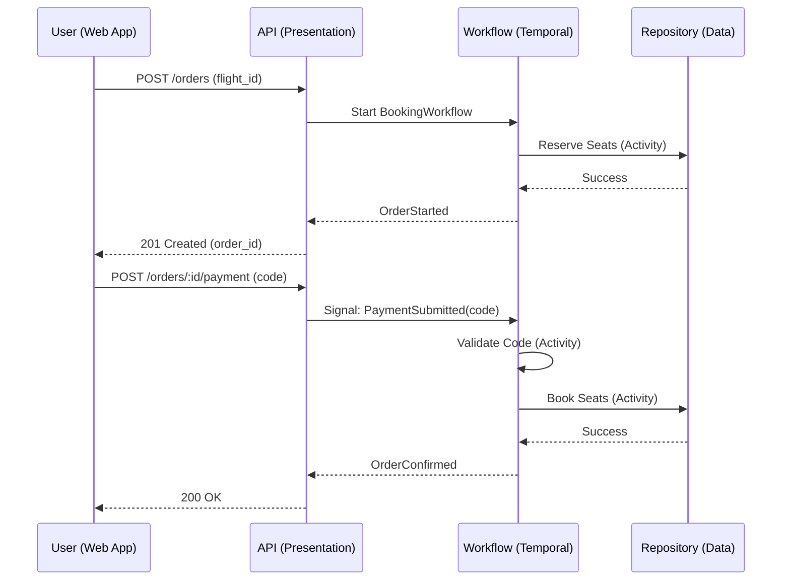

# Technical Plan: Flight Booking System (Temporal)

**Architect:** Senior System Architect
**Status:** PROPOSED
**Principles:** S.O.L.I.D, 3-Tier Layering, Temporal Orchestration

---

## 1. System Architecture

We will use a **3-Tier Architecture** to ensure the business logic (Temporal Workflows) remains decoupled from the delivery mechanism (REST API) and the storage implementation.

### 3-Tier Breakdown

| Tier | Responsibility | Tech Choice |
|------|----------------|-------------|
| **Presentation** | REST API, DTO Validation, Temporal Client | Go (Gin/Echo) |
| **Service** | **Temporal Workflow Orchestration**, Business Rules | Go (Temporal SDK) |
| **Data** | Seat Inventory, Flight Catalog, Order State | Repository Pattern (In-memory -> Postgres) |

### Data Flow Diagram (Happy Path)



---

## 2. Layer Boundaries & Interfaces

### Service Layer (The "Brain")
The core logic resides in a **Temporal Workflow**. It is agnostic of HTTP and DB implementation.

- **`BookingWorkflow`**: Manages the 15-minute timer, seat hold state, and payment attempt counters (3 methods, 3 attempts each).
- **Activities**:
    - `ReserveSeatsActivity(flightID, seatIDs)`
    - `ReleaseSeatsActivity(flightID, seatIDs)`
    - `ValidatePaymentActivity(code)`
    - `ConfirmBookingActivity(orderID)`

### Data Layer (The "Memory")
We define interfaces in the domain layer to allow swapping storage engines.

```go
type SeatRepository interface {
    GetSeats(flightID string) ([]Seat, error)
    HoldSeats(flightID string, seatIDs []string, orderID string) error
    ReleaseSeats(flightID string, seatIDs []string) error
    BookSeats(flightID string, seatIDs []string) error
}
```

---

## 3. Path to Production

### Phase 1: MVP (In-memory & Dev Server)
- **Storage:** In-memory maps for `SeatRepository` and `FlightRepository`.
- **Temporal:** Local `temporal server start-dev`.
- **Goal:** Validate the 15-minute continuous timer and the 3x3 payment retry logic.
- **Verification:** Unit tests for Workflow logic using `testsuite`.

### Phase 2: Scalability (Postgres & Cluster)
- **Storage:** Swap in-memory adapters for **Postgres**. Use row-level locking (`SELECT ... FOR UPDATE`) in `HoldSeats` to ensure strong consistency.
- **Temporal:** Deploy to a Temporal Cluster (Self-hosted or Cloud).
- **Workers:** Scale Go workers horizontally to handle concurrent bookings.
- **Goal:** Ensure no double-booking under high load.

### Phase 3: Observability & Resilience
- **Logging:** Structured JSON logging with `trace_id` propagated from API to Temporal.
- **Metrics:** Prometheus metrics for:
    - `order_expiry_rate`
    - `payment_failure_distribution`
    - `seat_hold_duration_p99`
- **Resilience:** Implement Temporal **Retry Policies** for activities and **Dead Letter Queues** for failed confirmations.

---

## 4. Implementation Checklist (S.O.L.I.D)

- [ ] **S**: `BookingWorkflow` handles orchestration; `PaymentActivity` handles validation.
- [ ] **O**: New payment providers can be added by implementing a new `PaymentService` interface.
- [ ] **L**: In-memory and Postgres repositories will pass the same integration test suite.
- [ ] **I**: `SeatRepository` is separate from `FlightRepository`.
- [ ] **D**: API depends on `TemporalClient` interface; Workflow depends on `Repository` interfaces.

---
