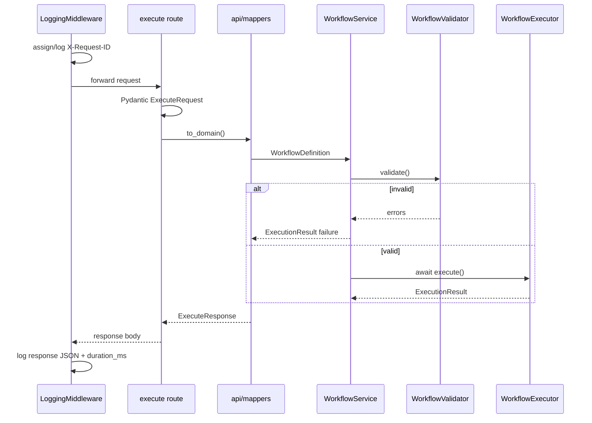
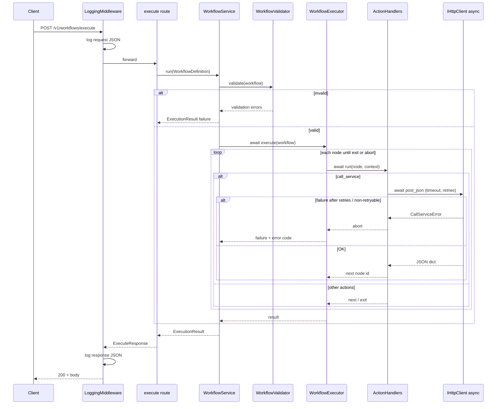
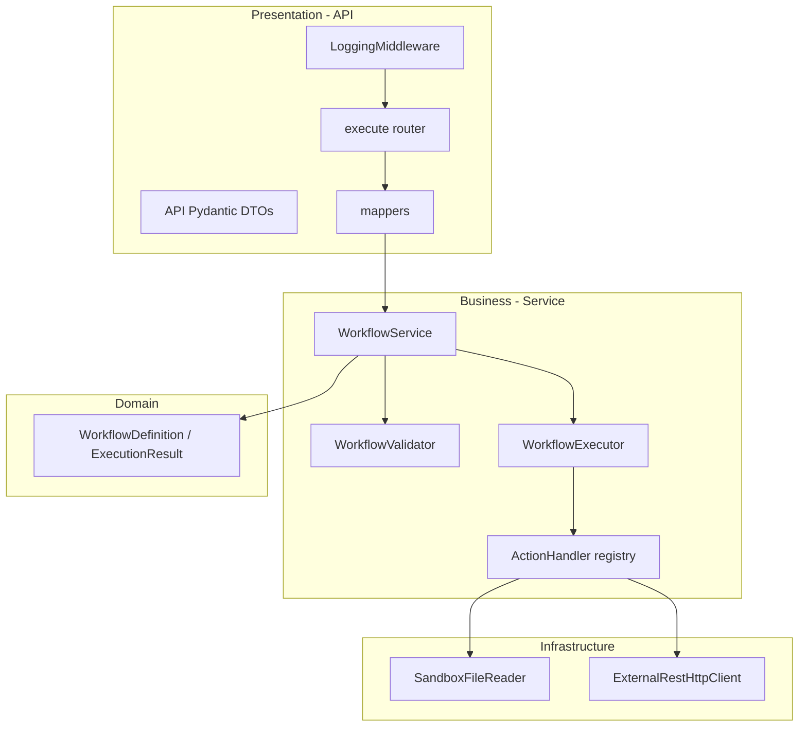

# Workflow Evaluator — System Architecture Plan

> Tech Lead interview backend (Python only). Principles: **S.O.L.I.D**, **3-tier architecture**, **fail without crash**, **full request/response logging**, **strict JSON validation**.

## 1. Context

| Item | Value |
|------|-------|
| Problem | Receive a workflow graph (JSON), validate it, execute actions, return success/failure, variables, accumulated print output, and structured errors. |
| Callers | Trusted internal frontend (MVP); design allows hardening for untrusted input later. |
| Constraints | **One exposed route**: `POST /v1/workflows/execute`. **Async outbound** `call_service` with per-attempt timeout, **retry on timeout** (backoff + jitter). Other call failures → immediate abort. FastAPI + Pydantic; variables **string \| number**. |
| Non-goals (MVP) | Run history DB, auth, client polling, global workflow step limits, unreachable-node rejection, exit messages/codes. |

### Clarifications captured from Q&A

| Topic | Decision |
|-------|----------|
| HTTP on business failure | **200** + `status: "failure"` in body |
| Graph | **Nodes + edges**; branching via **`on_true` / `on_false`** edge labels |
| `exit` required | Validator ensures workflow **can** reach an `exit` node (structurally); **dead/unreachable nodes allowed** |
| `print` | Per node: **concatenate all arguments** → one line → append to in-memory **deque**; response returns **full `prints` array** |
| Undefined variable | **Runtime failure** → customer gets detailed error; logged |
| `if_equals` | **Coerce both operands to string** before compare |
| `call_service` | **Async** outbound **POST** to **any external URL** (`http`/`https`); per-attempt timeout; retry on timeout (backoff + jitter); JSON in/out; abort with `CALL_SERVICE_*` on final failure |
| Public API (this service) | **Only** `POST /v1/workflows/execute` — no validate route, no proxy of external APIs |
| Correlation | Generate **`X-Request-ID`** (UUID) if missing; echo in response + logs |
| **Layering** | **API:** receive HTTP JSON → Pydantic validate → call business → map response. **Business:** caller-agnostic; no FastAPI/HTTP types. **Middleware:** log full request/response JSON bodies |

### API boundary (Q26)

Two different HTTP roles — do not conflate them:

| Role | Who | Endpoint / target |
|------|-----|-------------------|
| **Inbound (this service)** | Frontend / client | `POST /v1/workflows/execute` — sole public API |
| **Outbound (`call_service` step)** | Workflow executor → **external** REST service | Full URL in workflow JSON (e.g. `https://api.example.com/v1/orders`) |

The workflow evaluator **never** exposes the external APIs it calls. It **does not** recurse into `/v1/workflows/execute` unless a workflow author explicitly points `call_service.url` there (discouraged; not special-cased).

---

## 2. Workflow JSON schema (v1)

Frontend sends the workflow inside the execute request body (§5.1).

### 2.1 Top-level execute request

```json
{
  "workflow": {
    "schema_version": 1,
    "entry": "node-id",
    "nodes": [ /* Node */ ]
  }
}
```

| Field | Type | Required | Rules |
|-------|------|----------|-------|
| `workflow` | object | yes | See below |
| `workflow.schema_version` | integer | yes | Must be `1` for MVP |
| `workflow.entry` | string | yes | Must match a `nodes[].id` |
| `workflow.nodes` | array | yes | Min length 1; unique `id` |

### 2.2 Node (common shape)

Every node:

```json
{
  "id": "string",
  "action": "set_variable | call_service | read_file | print | if_equals | if_file_exists | exit",
  "next": "node-id | null",
  "on_true": "node-id | null",
  "on_false": "node-id | null",
  "...": "action-specific fields"
}
```

| Field | When used |
|-------|-----------|
| `next` | **Linear** nodes only — see routing table below |
| `on_true`, `on_false` | **Branching** nodes only (`if_equals`, `if_file_exists`) |
| `exit` | **No** routing fields |

**Routing exclusivity (required):** A node must use **either** linear routing **or** branch routing — **never both**.

| Routing mode | Allowed fields | Forbidden on same node |
|--------------|----------------|-------------------------|
| **Linear** | `next` (non-null string) | `on_true`, `on_false` must be **absent** |
| **Branch** | `on_true` and `on_false` (both non-null strings) | `next` must be **absent** |
| **Terminal** (`exit`) | none | `next`, `on_true`, `on_false` must be **absent** |

**Per-action routing:**

| `action` | Routing mode |
|----------|----------------|
| `set_variable`, `call_service`, `read_file`, `print` | **Linear** → `next` only |
| `if_equals`, `if_file_exists` | **Branch** → `on_true` + `on_false` only |
| `exit` | **Terminal** → no routing fields |

**Edge rules (validation):**

- Referenced ids must exist in `nodes`.
- **No mixed routing:** presence of `next` together with `on_true` or `on_false` → **`INVALID_NODE_ROUTING`**.
- **No cycles** in the graph formed by `next`, `on_true`, `on_false`.
- At least one **`exit`** node exists and is **reachable from `entry`** (dead branches/nodes elsewhere are OK).
- Branching nodes: **`on_true` and `on_false` required**; `next` forbidden.
- Linear nodes: **`next` required**; `on_true` / `on_false` forbidden.
- `exit` nodes: no outgoing fields.

### 2.3 Action payloads

#### `set_variable`

```json
{
  "id": "set-name",
  "action": "set_variable",
  "name": "userName",
  "value": "Alice",
  "next": "print-greet"
}
```

`value`: **string or number** (JSON types).

#### `call_service`

Calls an **external REST API** (separate process/service). Response is written to a workflow variable; this action is **not** an endpoint on the workflow evaluator.

```json
{
  "id": "fetch-data",
  "action": "call_service",
  "url": "https://api.example.com/v1/foo",
  "body": { "key": "value" },
  "result_variable": "apiResult",
  "timeout_seconds": 10,
  "max_retries": 3,
  "next": "use-result"
}
```

| Field | Rules |
|-------|--------|
| `url` | Full URL of an **external** REST API — **`https://` or `http://`**, valid host, no private schemes (`file://`, etc.). **Any public/external host** allowed in MVP (see §5 optional allowlist in Phase 2) |
| `body` | JSON object sent as POST body (default `{}` if omitted) |
| `result_variable` | Variable name; stores **JSON-serialized string** of the external API’s JSON response body |
| `timeout_seconds` | Optional; **per-attempt** HTTP timeout; must be ≤ `CALL_SERVICE_MAX_TIMEOUT_SECONDS` |
| `max_retries` | Optional; max **extra** attempts after the first timeout (default from env); must be ≤ `CALL_SERVICE_MAX_RETRIES` |

**Execution semantics:**

| Rule | Behavior |
|------|----------|
| Transport | **`await`** on async HTTP client (`httpx.AsyncClient`) — non-blocking under FastAPI |
| Per-attempt timeout | Default `CALL_SERVICE_TIMEOUT_SECONDS` (e.g. **10**); optional node `timeout_seconds` |
| **Retry policy** | Retry **only** on **timeout** (`httpx.TimeoutException` / read timeout). **No retry** on connection error, HTTP 4xx/5xx, or invalid JSON |
| Backoff | Exponential: `delay = min(base * 2^attempt, max_backoff)` then add **full jitter**: `sleep = random_uniform(0, delay)` |
| Attempts | Total tries = **`1 + max_retries`** (e.g. `max_retries=3` → up to 4 HTTP calls) |
| Success | Any attempt returns HTTP **2xx** + JSON → store in `result_variable`, continue to `next` (no further retries) |
| Failure | After all timeout retries exhausted → **stop workflow** with `CALL_SERVICE_TIMEOUT`; other errors → **immediate abort** (no retry) |

**Retry configuration (env, composition root):**

| Variable | Default (example) | Meaning |
|----------|-------------------|---------|
| `CALL_SERVICE_TIMEOUT_SECONDS` | `10` | Per-attempt timeout |
| `CALL_SERVICE_MAX_TIMEOUT_SECONDS` | `60` | Cap for node `timeout_seconds` |
| `CALL_SERVICE_MAX_RETRIES` | `3` | Default max **extra** retries after first timeout |
| `CALL_SERVICE_RETRY_BASE_SECONDS` | `0.5` | Base for exponential backoff |
| `CALL_SERVICE_RETRY_MAX_SECONDS` | `30` | Cap on backoff delay before jitter |
| `CALL_SERVICE_MAX_RETRIES_CAP` | `5` | Server cap for node `max_retries` |

**Backoff example** (`base=0.5`, `max_backoff=30`, `max_retries=3`):

| After attempt # | On timeout, wait before next try |
|-----------------|----------------------------------|
| 1 | `uniform(0, min(0.5, 30))` ≈ 0–0.5s |
| 2 | `uniform(0, min(1.0, 30))` |
| 3 | `uniform(0, min(2.0, 30))` |

Implement in **`ExternalRestHttpClient`** (infrastructure), not in the route or `WorkflowService`. Log each retry: `attempt`, `max_attempts`, `sleep_seconds`, `url`, `X-Request-ID` (from presentation context via optional log context — **not** passed into business domain models).

**Failure cases and error codes:**

| Code | When | `message` (example) |
|------|------|---------------------|
| `CALL_SERVICE_TIMEOUT` | Timeout on **final** attempt (retries exhausted) | `External call timed out after 4 attempts (10s per attempt)` |
| `CALL_SERVICE_CONNECTION_ERROR` | DNS/refused/network | `Could not connect to https://api.example.com/...` |
| `CALL_SERVICE_HTTP_ERROR` | Non-2xx status | `External API returned 503` |
| `CALL_SERVICE_INVALID_RESPONSE` | Not JSON or wrong content-type | `Response is not valid JSON` |
| `CALL_SERVICE_URL_NOT_ALLOWED` | Invalid URL at validation (bad scheme, missing host) | `URL must be http(s) with a valid host` |
| `CALL_SERVICE_HOST_NOT_ALLOWED` | Phase 2 only: host not on allowlist | `Host 'evil.com' is not on CALL_SERVICE_ALLOWED_HOSTS` |

Populate `error.step_id`, `error.action` (`call_service`), and `error.cause` (e.g. `timeout after 4 attempts`, `HTTP 503`, exception class) where useful.

External service must return **`Content-Type: application/json`** (or parseable JSON body) on success; otherwise **`CALL_SERVICE_INVALID_RESPONSE`** and **abort**.

#### `read_file`

```json
{
  "id": "read-cfg",
  "action": "read_file",
  "path": "config/app.json",
  "result_variable": "fileContent",
  "next": "..."
}
```

`path`: relative to **`WORKFLOW_FS_ROOT`**; no `..` segments; no absolute paths (MVP).

File content stored as **string** variable.

#### `print`

```json
{
  "id": "log-step",
  "action": "print",
  "parts": [
    { "type": "text", "value": "Hello " },
    { "type": "variable", "name": "userName" }
  ],
  "next": "..."
}
```

| Field | Rules |
|-------|--------|
| `parts` | Non-empty array |
| `part.type` | `"text"` \| `"variable"` |
| `part.value` | Required if `type=text` (string or number → stringified) |
| `part.name` | Required if `type=variable` |

**Runtime:** Resolve each part → concatenate in order → **one** string → **append to deque** (does not set variables).

#### `if_equals`

```json
{
  "id": "check",
  "action": "if_equals",
  "left": { "type": "variable", "name": "a" },
  "right": { "type": "literal", "value": 42 },
  "on_true": "yes-node",
  "on_false": "no-node"
}
```

Operand (`left` / `right`):

```json
{ "type": "literal", "value": "string | number" }
{ "type": "variable", "name": "varName" }
```

Compare after **string coercion** of both sides.

#### `if_file_exists`

```json
{
  "id": "check-file",
  "action": "if_file_exists",
  "path": "data/input.csv",
  "on_true": "...",
  "on_false": "..."
}
```

Same path rules as `read_file`.

#### `exit`

```json
{
  "id": "done",
  "action": "exit",
  "status": "success"
}
```

`status`: **`success`** \| **`failure`** only (MVP).

---

## 3. Three-tier model

### 3.1 Layer responsibilities

| Layer | Package | Owns | Must not |
|-------|---------|------|----------|
| **Presentation (API)** | `app/api/` | HTTP route, **API** Pydantic DTOs, **request/response logging middleware**, `X-Request-ID`, DTO ↔ domain mapping, HTTP status codes | Workflow execution, graph validation logic, file/HTTP I/O |
| **Business (Service)** | `app/services/` | `WorkflowService`, `WorkflowValidator`, `WorkflowExecutor`, handlers, **domain** models & errors | `Request`, `Response`, FastAPI, Starlette, headers, “who called” |
| **Infrastructure (Data)** | `app/infrastructure/` | `IFileReader`, `IHttpClient` adapters | Business rules |

**Dependency rule:** `api` → `services` → `domain` ← `infrastructure`. Business **never** imports from `api`.

### 3.2 API layer — thin controller only

The execute route does **four things** and nothing else:

1. **Receive** `POST /v1/workflows/execute` body (JSON).
2. **Validate** at the HTTP boundary with **API schemas** (`ExecuteRequest` / Pydantic) — malformed JSON shape fails here (422 or mapped 200 per policy).
3. **Map** `ExecuteRequest` → **`WorkflowDefinition`** (domain type in `app/domain/`).
4. **Call** `await workflow_service.run(workflow_definition)` and **map** `ExecutionResult` → `ExecuteResponse`.

```python
# app/api/routes/workflow.py — illustrative only
@router.post("/v1/workflows/execute", response_model=ExecuteResponse)
async def execute(
    body: ExecuteRequest,
    workflow_service: WorkflowService = Depends(get_workflow_service),
) -> ExecuteResponse:
    workflow = to_domain(body)
    result = await workflow_service.run(workflow)
    return to_response(result)
```

| Concern | Where it lives |
|---------|----------------|
| JSON request/response **logging** | **`LoggingMiddleware`** (§3.5) — not in the route |
| `X-Request-ID` | Middleware or route **presentation only** — not passed into `WorkflowService` (business is caller-agnostic) |
| Graph / routing / runtime rules | **`WorkflowValidator`** + **`WorkflowExecutor`** (business) |
| Uncaught exception → safe JSON | Route **exception handler** (presentation) |

### 3.3 Business layer — caller-agnostic

**`WorkflowService`** is the single entry point for use cases. It does not know whether the caller is HTTP, CLI, or a test.

```python
# app/services/workflow_service.py — illustrative only
class WorkflowService:
    def __init__(
        self,
        validator: WorkflowValidator,
        executor: WorkflowExecutor,
    ) -> None: ...

    async def run(self, workflow: WorkflowDefinition) -> ExecutionResult:
        validation = self.validator.validate(workflow)
        if not validation.ok:
            return ExecutionResult.failure_from_validation(validation)
        return await self.executor.execute(workflow)
```

| Type | Package | Known to business? |
|------|---------|-------------------|
| `WorkflowDefinition`, `Node`, `ExecutionResult`, `WorkflowError` | `app/domain/` | Yes |
| `ExecuteRequest`, `ExecuteResponse` | `app/api/schemas/` | **No** |
| `fastapi.Request`, headers, client IP | `app/api/` | **No** |

Tests call **`WorkflowService.run()`** directly with domain fixtures — no `TestClient` required for business unit tests.

### 3.4 Request/response logging middleware

Register on the FastAPI app **before** routers (outermost or after CORS if present).

| Responsibility | Detail |
|----------------|--------|
| **Request** | After body is available: log method, path, **`X-Request-ID`**, full JSON body (parsed dict; on parse failure log raw bytes/length) |
| **Response** | Intercept response body buffer; log status code, `X-Request-ID`, full JSON response, `duration_ms` |
| **Scope** | Applies to `/v1/workflows/execute` (and optionally `/health` at DEBUG) |
| **Implementation** | `app/api/middleware/logging.py` — uses structured logger; no business imports |



### 3.5 Core ports (D — Dependency Inversion)

```python
class IFileReader(Protocol):
    def read_text(self, relative_path: str) -> str: ...
    def exists(self, relative_path: str) -> bool: ...

class IHttpClient(Protocol):
    async def post_json(
        self,
        url: str,
        body: dict,
        *,
        timeout_seconds: float,
        max_retries: int,
    ) -> dict: ...
    # Raises CallServiceError: retries timeouts with backoff+jitter; no retry on other errors
```

| Interface | Responsibility |
|-----------|----------------|
| `IFileReader` | Sandbox-root file read/exists (sync OK for MVP) |
| `IHttpClient` | **Async** POST + JSON parse + per-attempt timeout + **timeout-only retry** (backoff + jitter) |
| `IActionHandler` (per action) | **S** — one class per `action` type |
| `IWorkflowValidator` | Structural + graph validation |
| `IWorkflowExecutor` | Orchestration only |
| `WorkflowService` | **Facade** for the execute use case (validator + executor) |

**Composition root:** `app/dependencies.py` constructs `WorkflowService` with concrete infra adapters; FastAPI `Depends(get_workflow_service)` only in **API** layer.

### 3.6 Executor flow (async `call_service`, sync client HTTP)

Client still sends **one blocking POST** and receives the final JSON when the workflow finishes (or aborts).



**Abort contract:** Any `WorkflowRuntimeError` (including all `CALL_SERVICE_*` codes) ends the loop immediately. Partial `variables` and `prints` from steps **before** the failure may be returned (documented behavior; tests should assert this).

**Crash safety:** No uncaught exceptions cross the API boundary; **middleware + route exception handler** map to `status: failure` + `error` DTO; stack traces only in logs.

### 3.7 Layer dependency diagram



---

## 4. API surface

### 4.1 `POST /v1/workflows/execute`

**Handled by:** `LoggingMiddleware` → thin route → `WorkflowService` (see §3.2–3.4).

**Request:** body = §2.1 (only input parameter is JSON). Validated as `ExecuteRequest` before calling business layer.

**Response (200 always for handled requests):**

```json
{
  "status": "success",
  "variables": { "userName": "Alice", "apiResult": "{\"ok\":true}" },
  "prints": ["Hello Alice", "done"],
  "error": null
}
```

Failure example (`call_service` timeout — execution **cancelled** at that step):

```json
{
  "status": "failure",
  "variables": { "orderId": "42" },
  "prints": [],
  "error": {
    "code": "CALL_SERVICE_TIMEOUT",
    "message": "External call timed out after 4 attempts (10s per attempt)",
    "step_id": "fetch-data",
    "action": "call_service",
    "cause": "httpx.TimeoutException; retries exhausted"
  }
}
```

Other failure example:

```json
{
  "status": "failure",
  "variables": { },
  "prints": [],
  "error": {
    "code": "UNDEFINED_VARIABLE",
    "message": "Variable 'x' is not defined",
    "step_id": "print-greet",
    "action": "print",
    "cause": null
  }
}
```

| Field | Description |
|-------|-------------|
| `status` | **`success`** \| **`failure`** (from `exit` or validation/runtime) |
| `variables` | Final map (string \| number values only) |
| `prints` | Ordered list from deque (all print nodes) |
| `error` | Populated on failure; **detailed** shape |

**Headers:** `X-Request-ID` on request (optional) and response (always set).

### 4.2 Health (optional, not counted as “workflow API”)

| Method | Path | Purpose |
|--------|------|---------|
| GET | `/health` | Liveness for deploy |

---

## 5. Validation vs runtime

| Check | Layer | On failure |
|-------|-------|------------|
| HTTP JSON shape / types | **API** (`ExecuteRequest`) | 422 (or mapped policy) — **before** business |
| Graph, routing exclusivity, cycles, reachable `exit` | **Business** (`WorkflowValidator`) | `ExecutionResult` + `INVALID_*` — no executor run |
| Dead nodes | **Business** validator | Allowed (MVP) |
| `call_service` URL scheme / shape | **Business** validator | `CALL_SERVICE_URL_NOT_ALLOWED` |
| `call_service` host allowlist (Phase 2, optional) | **Business** validator | `CALL_SERVICE_HOST_NOT_ALLOWED` |
| `timeout_seconds` > server max | **Business** validator | `CALL_SERVICE_TIMEOUT_TOO_LARGE` |
| Undefined variable | **Business** executor | `UNDEFINED_VARIABLE` → abort |
| File outside sandbox / `..` | **Business** executor | `PATH_NOT_ALLOWED` |
| `call_service` timeout (after retries) / connection / HTTP / non-JSON | **Business** executor via `IHttpClient` | `CALL_SERVICE_*` → **abort**; only **timeout** is retried |
| `max_retries` > server cap | **Business** validator | `CALL_SERVICE_RETRIES_TOO_LARGE` |

---

## 6. S.O.L.I.D mapping

| Principle | Implementation |
|-----------|----------------|
| **S** | `PrintActionHandler` only handles print; `WorkflowExecutor` only orchestrates |
| **O** | New action = new handler class + registry entry; no executor rewrite |
| **L** | `FakeFileReader` / `FakeHttpClient` usable wherever real adapters are |
| **I** | Small `IFileReader`, `IHttpClient`; no god-interface |
| **D** | Business depends on `Protocol`s; **composition root** (`dependencies.py`) injects adapters; API `Depends()` only wires `WorkflowService` at the edge |

---

## 7. Logging & observability

| Event | Layer | Content |
|-------|-------|---------|
| HTTP request | **`LoggingMiddleware`** | method, path, full JSON body, `X-Request-ID` |
| HTTP response | **`LoggingMiddleware`** | status code, full JSON body, `duration_ms`, `X-Request-ID` |
| Business failure | Optional in `WorkflowService` / executor | `error.code` at WARNING — **not** a substitute for middleware |
| Step trace (post-MVP) | Business or infra | `step_id`, `action` only if needed |

Middleware owns **request/response JSON** logging; the business layer does not log HTTP bodies and does not receive `Request` objects.

Structured JSON logs to **stdout** (Phase 3 ready).

---

## 8. Path to production

### Phase 1 — MVP (this submission)

| Component | Choice |
|-----------|--------|
| API | FastAPI, single execute endpoint |
| Validation | Full graph checks except unreachable-node pruning |
| I/O | `ExternalRestHttpClient`: per-attempt timeout + **timeout retry** (exponential backoff + full jitter) |
| Tests | Unit: fail twice with timeout then succeed; assert backoff sleeps mocked; 503 not retried; integration slow stub |
| Config | `WORKFLOW_FS_ROOT`, `CALL_SERVICE_*` timeout/retry env vars (see §2.3 `call_service`) |

### Phase 2 — Hardening

| Item | Change |
|------|--------|
| Trust | Optional `CALL_SERVICE_ALLOWED_HOSTS` allowlist; block link-local/metadata IPs; max body size; step/time limits |
| `call_service` | Optional host allowlist + SSRF hardening (private IP ranges) |
| Validation | Optional reject unreachable nodes |
| Auth | API key middleware |

### Phase 3 — Operate

| Signal | Tooling |
|--------|---------|
| Metrics | Prometheus: executions, failures by code, latency |
| Tracing | OpenTelemetry across `call_service` |
| Persistence | Optional run history repository |

---

## 9. Suggested layout

```text
app/
  main.py                    # FastAPI app + register LoggingMiddleware
  api/
    routes/workflow.py       # thin: validate DTO → service → response DTO
    middleware/logging.py    # log request/response JSON + X-Request-ID
    schemas/execute.py       # ExecuteRequest, ExecuteResponse (HTTP only)
    mappers.py               # DTO ↔ domain (only imported by api/)
  domain/
    errors.py
    models.py                # WorkflowDefinition, ExecutionResult, nodes
  services/
    workflow_service.py      # caller-agnostic use case entry
    validator.py
    executor.py
    handlers/
      base.py
      set_variable.py
      call_service.py
      read_file.py
      print.py
      if_equals.py
      if_file_exists.py
      exit.py
  infrastructure/
    file_reader.py
    http_client.py           # retry + backoff + jitter on timeout
    retry_policy.py          # pure: compute_backoff_sleep(attempt) for tests
  dependencies.py            # DI wiring
tests/
  unit/
  integration/
```

---

## 10. Implementation order

1. Domain models + API DTOs + `mappers.py` + fixtures
2. `WorkflowValidator` + unit tests (no FastAPI)
3. Handlers + `WorkflowExecutor` + unit tests (inject fakes)
4. `WorkflowService` + business integration tests
5. Infrastructure adapters
6. `LoggingMiddleware` + thin route + HTTP integration tests (middleware logs asserted)
7. **`tests/integration/api/`** — canonical business-scenario suite: POST JSON to `/v1/workflows/execute`, assert full response contracts (happy path, validation, branching, I/O failures)

---

## 11. Example fixture (minimal happy path)

```json
{
  "workflow": {
    "schema_version": 1,
    "entry": "set",
    "nodes": [
      {
        "id": "set",
        "action": "set_variable",
        "name": "x",
        "value": 1,
        "next": "print-it"
      },
      {
        "id": "print-it",
        "action": "print",
        "parts": [{ "type": "variable", "name": "x" }],
        "next": "done"
      },
      {
        "id": "done",
        "action": "exit",
        "status": "success"
      }
    ]
  }
}
```

Expected: `status=success`, `variables.x=1`, `prints=["1"]`.

---

## 12. Open points (post-MVP)

- Variable substitution in `call_service.body` (`{{name}}`)
- Native JSON variable type instead of stringified `apiResult`
- Webhook/streaming if long-running workflows are added
